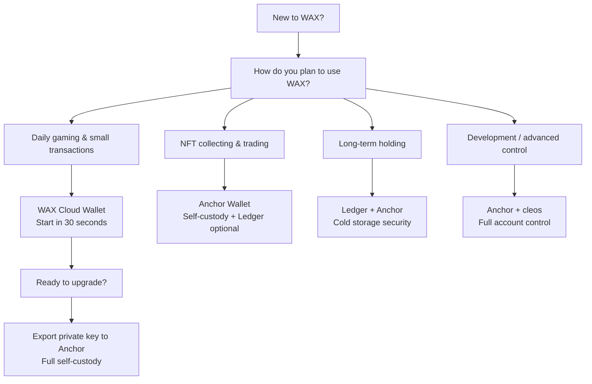

## What is a Crypto Wallet?

A crypto wallet does not "store" your cryptocurrencies — it stores the private keys that prove you own them. Think of it as a keychain: the key (private) opens the door and allows you to move what is inside, but the safe itself is on the blockchain.

Every wallet generates a key pair:
- **Public key:** your address to receive funds (like an account number)
- **Private key:** your master password to send funds (never share it)

For WAX specifically, your wallet is your gateway to the ecosystem: buying tickets, playing games like CryptoBingo, collecting NFTs, and trading on marketplaces.

## Types of Wallets

**Custodial Wallets:** a third party holds your private keys. You trust the company's security. Easy to start, but you do not fully control your account.

**Hybrid Model (passkeys):** services like the new WAX Cloud Wallet (2026) use passkeys (Face ID / Touch ID) to protect your private key on your device. You can optionally save a 12-word mnemonic phrase and export the private key. This is no longer purely custodial — it gives you recovery options and the ability to move to full self-custody later.

**Self-Custody:** you generate and control your private keys. Example: Anchor Wallet. Full control, full responsibility. If you lose your seed phrase, no one can recover your account — including the wallet provider.

**Hot Wallet vs Cold Wallet:** hot wallets stay connected to the internet (practical for gaming, daily use). Cold wallets are offline devices like Ledger (maximum security for long-term holdings).

## WAX Cloud Wallet (My Cloud Wallet)

The new WAX Cloud Wallet (released March 2026) is a major upgrade. It uses **passkeys** (Face ID, Touch ID, fingerprint, or PIN) instead of email and password. Your private key stays encrypted on your device, protected by your device's secure enclave.

### Key Features

- **Passkey sign-in:** authenticate with biometrics — no passwords to forget
- **12-word mnemonic phrase:** generated at account creation for backup and recovery
- **Private key export:** you can export your private key and import it into Anchor at any time
- **Vault (Beta):** persistent signing session — confirm your passkey once, then sign multiple transactions without repeated prompts. Can be disabled in Settings if you prefer to confirm every transaction
- **Account recovery:** import your mnemonic phrase on a new device to recreate your passkey. Supports iCloud Keychain and Google Password Manager
- **Free account creation:** no WAX account creation fee
- **Migration from legacy wallet:** guided migration flow with Soft Claim (keep some Cloud Wallet integration) or Hard Claim (full key ownership)
- **Mobile support:** iOS and Android

### Pros

- Fastest onboarding — under 30 seconds
- Biometric security
- Free to create and use
- Recoverable with mnemonic phrase
- Exportable to self-custody wallets
- Native WAX experience

### Cons

- Device-dependent — losing all your devices without the mnemonic phrase means losing access
- Browser-dependent on desktop (Chrome, Safari, Brave, Edge recommended; see [WAX docs for compatibility](https://docs.wax.io/learn/getting-started/mycloudwallet/troubleshooting))
- Passkey conflicts with competing password managers (temporarily disable Dashlane, etc., during setup)

### When to Choose WAX Cloud Wallet

> Best for beginners, casual players, and anyone who wants to start playing on WAX in under a minute. Start here, upgrade later.

## Anchor Wallet

[Anchor Wallet](https://greymass.com/anchor) is an open-source desktop and mobile wallet by Greymass. It is designed for full self-custody on Antelope-based blockchains, including WAX, Vaulta (formerly EOS), Telos, FIO, and Proton.

### Key Features

- **12-word seed phrase:** you generate and control it. Anchor never sees your private keys
- **AES-256 encrypted local storage:** your keys are encrypted on your device
- **Ledger hardware wallet integration:** connect your Ledger Nano S, Nano X, or Stax for cold storage signing (desktop only)
- **Multi-chain:** manage accounts across WAX, Vaulta, Telos, and more from one app
- **Greymass Fuel:** free transactions (limited CPU time) on supported Antelope networks
- **Account management:** view resources (CPU, NET, RAM), stake tokens, manage permissions
- **dApp interaction:** sign in to WAX dApps like CryptoBingo, NeftyBlocks, AtomicHub
- **Desktop and Mobile:** Windows, macOS, Linux, iOS, Android

### Pros

- Full control of your private keys
- Open source (auditable code)
- Hardware wallet support (Ledger)
- Multi-chain
- Rich account management tools
- Free transactions via Fuel

### Cons

- Setup takes longer (5-10 minutes)
- You are solely responsible for the seed phrase — no recovery if lost
- No passkey/biometric option (requires password to unlock)
- Ledger support only on desktop

### When to Choose Anchor

> Best for users who want full control, hold significant WAX tokens, collect NFTs, or need advanced account management.

## Other Wallet Options

### Ledger Hardware Wallet

[Ledger](https://www.ledger.com/) devices (Nano S Plus, Nano X, Stax) offer cold storage security for WAX accounts. Your private keys never leave the device.

- Install the **EOS app** on your Ledger (there is no dedicated WAX app — WAX uses the same elliptic curve as EOS)
- Connect to Anchor Wallet on desktop to interact with WAX dApps
- Use for long-term holdings and high-value accounts
- Not ideal for daily gaming (requires physical device to sign)

**Note:** Trezor Model T also supports WAX through the EOS app.

### Wombat Wallet

A multi-chain browser wallet commonly used with WAX games and NFT platforms. Supports WAX, Ethereum, BNB Chain, and Polygon. Good alternative for users who want a single wallet across multiple ecosystems.

### cleos (Command Line)

For developers and operators. The official WAX command-line tool for interacting with the blockchain directly. Use for scripting, automation, and advanced account operations.

## Comparison Table

| Feature | WAX Cloud Wallet | Anchor Wallet | Ledger + Anchor | Wombat |
|---|---|---|---|---|
| **Custody** | Hybrid (passkeys) | Self-custody | Cold storage (self-custody) | Self-custody |
| **Setup time** | ~30 seconds | ~5 minutes | ~15 minutes | ~2 minutes |
| **Security** | Biometric + passkey | AES-256 encrypted | Hardware (offline keys) | Encrypted local |
| **Seed phrase** | Optional (12 words) | Required (12 words) | Required (24 words) | Required (12 words) |
| **Recovery** | Mnemonic + passkey | Seed phrase | Seed phrase (Ledger recovery) | Seed phrase |
| **Ledger support** | No | Yes (desktop) | Native | No |
| **Multi-chain** | WAX only | WAX, Vaulta, Telos, FIO, Proton | Via Anchor | WAX, ETH, BNB, Polygon |
| **Free transactions** | Yes | Yes (Fuel) | Via Anchor | No |
| **Best for** | Beginners, gaming | Advanced users, collectors | Long-term storage | Cross-chain users |
| **Platform** | Web browser | Desktop + Mobile | Desktop + Ledger | Browser extension |

## Which Wallet Should You Choose?

### Quick Recommendations

| Your profile | Recommended wallet |
|---|---|
| Complete beginner, just want to play | WAX Cloud Wallet |
| Play daily, small buy-ins | WAX Cloud Wallet |
| Play + hold NFTs worth over $100 | Anchor Wallet |
| Serious collector / trader | Anchor Wallet |
| Large WAX holdings (>$1000) | Ledger + Anchor |
| Developer / power user | Anchor + cleos |
| Use multiple blockchains daily | Wombat or Anchor |

## How to Connect Your Wallet to CryptoBingo

Connecting your wallet to CryptoBingo is simple:

1. Click **Connect Wallet** on the top right
2. Choose **WAX Cloud Wallet** or **Anchor**
3. Confirm the connection in your wallet
4. You are ready to buy tickets and play

Your tickets, wins, and prizes are linked to your WAX blockchain account — provably fair and verifiable on-chain.

## Security Tips

- **Seed phrase:** never digitize it. Write it on paper and store it in a safe place — a fireproof safe is even better. Never photograph it or store it in cloud notes
- **2FA:** enable two-factor authentication wherever available
- **Fake sites:** always verify the URL before connecting your wallet. Bookmark the official sites
- **Never share private keys:** no legitimate service — including CryptoBingo — will ever ask for your seed phrase or private key
- **Start small:** if you are new, start with small amounts. Get comfortable with the wallet before depositing significant value
- **Multiple devices:** if using WAX Cloud Wallet, save the mnemonic phrase and consider adding your passkey to a second device
- **Ledger users:** always verify the destination address on your Ledger screen before signing a transaction

## Summary

| Wallet | Best For | Security Level | Setup Time |
|---|---|---|---|
| WAX Cloud Wallet | Beginners, daily gaming | Good (passkeys) | 30 seconds |
| Anchor Wallet | Advanced users, collectors | Strong (self-custody) | 5 minutes |
| Ledger + Anchor | Long-term holders | Maximum (cold storage) | 15 minutes |
| Wombat | Cross-chain users | Good (self-custody) | 2 minutes |

**Our recommendation:** start with WAX Cloud Wallet. Play CryptoBingo, get comfortable with the ecosystem. When you accumulate more tokens or want full control, export your private key to Anchor. For significant holdings, add a Ledger for cold storage.

Ready to start? Follow our [step-by-step tutorial to create your first WAX wallet](/en/tutorials/create-wax-wallet).

---
*Verified: July 2026. All information validated against official WAX documentation (docs.wax.io), Anchor Wallet (greymass.com), and WAX io official announcements. Passkeys, Vault, hard claim flow, Ledger integration — all confirmed current as of Q3 2026.*
