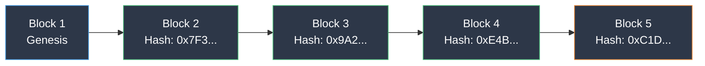

## What Is a Blockchain?

Imagine a notebook that everyone can see and no one can erase. Each new page (block) contains a set of transactions and a reference to the previous page. This notebook is not kept in anyone's drawer — copies of it exist on thousands of computers around the world simultaneously.

That is a blockchain: a shared, decentralized, and immutable digital ledger.

Every time someone buys a bingo ticket, a draw happens, or a prize is paid, it gets recorded in this notebook. Anyone can look at it. No one can change what was written.

## How It Works

### Blocks and the Chain

Each block is like a page in the notebook:

- Contains transactions (ticket purchases, draws, prizes)
- Has a timestamp and a unique fingerprint (hash)
- References the previous block's fingerprint

When someone tries to alter an old block, the fingerprint changes and the chain breaks — every node detects the tampering immediately.

Each block locks the previous one in place. Changing one block means recalculating every block after it — across thousands of computers. This is what makes blockchain tamper-proof.

### Consensus: Agreement Without a Boss

Before a new block is added, the entire network must agree it is valid. This is called consensus. On WAX, the blockchain used by CryptoBingo, this process takes approximately 1.5 seconds.

No central server controls the data. Thousands of independent computers (nodes) maintain identical copies of the ledger. To defraud the system, an attacker would need to control more than half the network — practically impossible on established blockchains like WAX.

### Immutability: Written in Stone

Once a transaction is recorded and confirmed, it cannot be changed or removed. For CryptoBingo, this means every draw result, every prize payment, and every ticket purchase is recorded permanently. No one — not even the platform — can alter the outcome after the fact.

### Transparency: Open for Inspection

All transactions are public. Anyone can verify how many tickets were sold, how much was paid in prizes, and whether results were fair. You do not need to trust the house — the data is available for anyone to check.

## Common Myths About Blockchain

**"Blockchain is just cryptocurrency."** No. Cryptocurrency is one application of blockchain — like email is one application of the internet. Blockchain is infrastructure for trust, money is just the first use case.

**"Blockchain is slow."** It depends on the design. WAX processes transactions in about 1.5 seconds with zero fees. The WAX Cloud Wallet lets anyone create an account in 30 seconds using passkeys (Face ID / Touch ID). Many people use blockchain without even knowing it.

**"Blockchain is complicated to use."** The user interface looks like any website. The blockchain runs invisibly underneath. You click "buy ticket" and the technology handles the rest.

**"Blockchain consumes enormous energy."** Not all blockchains are Bitcoin. WAX has been carbon neutral since 2021. The energy per transaction is negligible compared to proof-of-work chains. WAX's DPoS mechanism is 125,000x more energy efficient than Proof of Work [^1].

## Blockchain Beyond Cryptocurrency

Blockchain technology has applications far beyond digital money:

- **Gaming:** provably fair random outcomes, automatic prize payments, verifiable item ownership
- **Supply chain:** track products from factory to store with tamper-proof records
- **Identity:** self-sovereign identity where you control your personal data
- **Voting:** transparent, auditable elections
- **Real estate:** immutable property records and programmable transfers

For gaming in particular, blockchain eliminates the fundamental trust problem: players no longer need to trust that the platform is honest. The code guarantees honesty [^2].

## Why CryptoBingo Uses Blockchain

Online bingo has a trust problem. In traditional platforms, the operator controls the random number generator, the prize pool, and the payment system. Players must trust that the operator is honest.

CryptoBingo solves this by putting the entire game on the WAX blockchain:

1. **Provably fair draws:** every draw uses a cryptographic random number generator with three independent entropy sources. After each game, anyone can verify that the result was not manipulated. See our [provably fair guide](/en/blog/provably-fair) for the technical details.

2. **Automatic prizes:** when you win, payment is processed by the smart contract instantly. No human approval, no delays, no "we will process your withdrawal in 3-5 business days."

3. **Zero hidden fees:** the game rules are coded in the smart contract and visible to everyone. Ticket prices, prize structures, and payout rules are immutable.

4. **Total transparency:** every buy, every draw, every prize is recorded on the public blockchain. You can verify the entire history of any game. See our [security guide](/en/blog/cryptobingo-e-seguro) for more.

5. **No trust required:** you do not need to trust the CryptoBingo team. The code is the guarantee. As the saying goes: *"Don't trust, verify."*

## Frequently Asked Questions

### What is the difference between blockchain and a regular database?

A regular database is controlled by one organization. They can change data, delete records, or stop the service. A blockchain is controlled by thousands of independent nodes. No single entity controls the data, records cannot be deleted, and the service continues as long as at least one node is running.

### Do I need to understand blockchain to use CryptoBingo?

No. You use the website just like any other bingo platform. The blockchain runs behind the scenes. If you want to verify results, you can use public block explorers without any special software.

### Is blockchain gaming legal?

Blockchain gaming exists in a regulatory gray area in many jurisdictions. CryptoBingo operates in compliance with applicable regulations. Always check your local laws before participating in any blockchain-based gaming platform.

### How do I get started on WAX?

Create a WAX Cloud Wallet at mycloudwallet.com. The process takes about two minutes — choose a username, set up a passkey (Face ID, Touch ID, or fingerprint), and your wallet is ready. No email, no password, no seed phrase required for basic use. Follow our [wallet tutorial](/en/tutorials/criar-carteira-wax) for step-by-step instructions.

## Summary

Blockchain is the infrastructure that makes CryptoBingo possible: fair draws, instant prizes, total transparency, and zero need for trust. You do not need to understand all the technical details to benefit — just like you do not need to understand TCP/IP to use the internet.

The difference is that with blockchain, you can verify everything yourself. Every ticket, every draw, every prize is recorded in the public notebook — visible to everyone, alterable by no one.

Ready to play? [Create your WAX wallet](/en/tutorials/criar-carteira-wax) and get your first ticket.

---

*This information reflects CryptoBingo's current implementation as of July 2026. Always verify the latest documentation for updates.*

[^1]: Source: [WAX Blockchain — Carbon Neutral Since 2021](https://wax.io/)
[^2]: Source: [WAX Network Stats — DappRadar](https://dappradar.com/blog/wax-blockchain-2024-overview)
