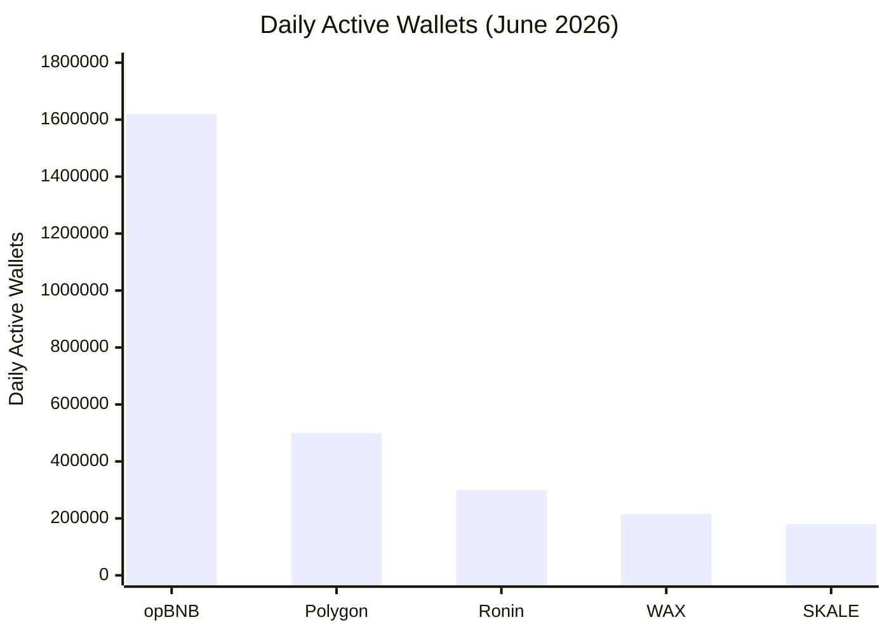

## What Is WAX Blockchain?

WAX (Worldwide Asset eXchange) is a layer-1 blockchain built specifically for gaming, NFTs, and digital assets. Unlike general-purpose blockchains that try to do everything, WAX is optimized for what matters in gaming: speed, zero fees, and mass adoption.

Launched in 2019, WAX runs on the **Antelope framework** (formerly EOSIO) — the same technology behind Telos, Vaulta (formerly EOS), UX Network, Proton, Ultra, and FIO. This shared foundation means WAX inherits battle-tested infrastructure while maintaining its own focus: being the most accessible blockchain for everyday users.

**Key differentiators:**
- **Zero gas fees** — players never pay transaction costs
- **1.5-second block time** with instant finality
- **Carbon neutral** since 2021 (certified by Climate Care)
- **Free account creation** — no paywall, no credit card needed
- **Passkey-based wallets** — Face ID / Touch ID instead of seed phrases

## What Makes WAX Special?

### Zero Gas Fees

On Ethereum, a single transaction can cost $1–$50 depending on network congestion. On WAX, transactions are free. Instead of burning fees, WAX uses a resource-based model where users stake WAXP tokens for CPU and NET — or use the free PowerUp system introduced in 2026 after the removal of the 5 WAXP account creation fee.

For gaming, this is revolutionary. Players can buy tickets, claim prizes, and trade assets thousands of times without worrying about gas costs. The friction that kills micro-transactions on other chains simply does not exist on WAX.

### 1.5-Second Finality

Blocks are produced every 1.5 seconds using Delegated Proof of Stake (DPoS) consensus. With the Savanna upgrade (Antelope Spring v1.0, September 2024), finality dropped from ~3 minutes to approximately 1 second — a 100× improvement.

Compare that to:
- **Ethereum:** ~12 seconds block time, ~2 minutes for probabilistic finality
- **Bitcoin:** ~10 minutes block time, ~1 hour for full confirmation
- **Polygon:** ~2 seconds, but finality depends on Ethereum settlement

WAX delivers near-instant settlement — a critical requirement for real-time gaming where waiting minutes for a transaction to confirm breaks the user experience.

### Carbon Neutral Since 2021

WAX is one of the few carbon-neutral blockchains, certified by Climate Care. Its DPoS mechanism is 125,000× more energy efficient than Proof of Work systems. The entire WAX network consumes roughly the same energy as 5.5 US households per year, while offsetting over 211 tonnes of CO₂.

### Free Account Creation

In March 2026, WAX removed the 5 WAXP account creation paywall, making new account creation completely free. Combined with the new passkey-based Cloud Wallet, anyone can create a WAX account in under 30 seconds using Face ID or Touch ID — no seed phrases, no email, no passwords.

## Numbers That Matter

WAX consistently ranks among the top gaming blockchains by real user activity:

- **215,650 daily active wallets** (June 2026, Gate News) — 5th among gaming chains, 11.98% growth in 30 days
- **570–687 million transactions per quarter** — more than any other gaming chain per user
- **15 million+ users** and over **30,000 dApps** — one of the largest ecosystems in Web3
- **23 million+ transactions per day** — sustained throughput that proves the infrastructure scales
- **3rd most active blockchain for gaming** by wallet count in 2024–2025 (DappRadar)

**Sources:** DappRadar, Gate News (June 2026), WAX.io

### How WAX Compares

*Data source: Gate News, June 2026*

## WAX vs Competitors

| Feature | WAX | opBNB | Polygon | Ronin | Vaulta |
|---------|-----|-------|---------|-------|--------|
| Transaction fees | Zero | Low ($0.001) | Low ($0.01) | Low ($0.001) | Low ($0.001) |
| Block time | 1.5s | ~1s | ~2s | ~3s | ~1s |
| Finality | ~1s | ~1s | ~2s (checkpoint) | ~3s | ~1s |
| DAU (Jun 2026) | 215K | 1.62M | ~500K | ~300K | ~50K |
| Tx/quarter | ~687M | ~500M | ~400M | ~200M | ~100M |
| Carbon neutral | Yes | No | Partial | No | No |
| Cloud Wallet (passkeys) | Yes (30s) | No | No | No | No |
| Antelope native | Yes | No | No | No | Yes |
| Gaming focus | Primary | General | General | Gaming | Banking |
| Free account creation | Yes | No | No | No | No |

WAX wins on **transactions per wallet**: each WAX user averages ~599 on-chain actions per month — more than any competing chain. This is the metric that matters for real user engagement, not just speculative activity.

## WAX Ecosystem

### Alien Worlds

The most-played blockchain game of all time, with **420,000 monthly active wallets** (Q3 2025) and 90,000+ daily active accounts. Players mine Trilium (TLM), compete for planetary governance, and participate in a DAO-driven metaverse that now spans multiple games including Mayhem, Outlaw Troopers, and Planetary Defense.

### AtomicHub

The largest NFT marketplace on WAX, where users buy, sell, and create NFTs with near-zero fees. In Q4 2024 alone, WAX processed $935,328 in NFT trading volume across 316,080 sales.

### NeftyBlocks

An NFT creation platform with gamification tools — creators can launch packs, set royalties, and build custom storefronts without writing code.

### My Cloud Wallet (formerly WAX Cloud Wallet)

The wallet that makes blockchain invisible. Since March 2026, it uses passkeys (Face ID / Touch ID) instead of passwords or seed phrases for everyday use. A 12-word mnemonic serves as recovery backup, but 99% of users will never need to see it. Account creation takes 30 seconds, and the new Vault feature (2026) creates persistent signing sessions so users can play without approving every transaction individually.

Enterprise features like WharfKit SDK and the Cloud Wallet Bridge (supporting TON, Solana, Ethereum, Polygon, BNB Smart Chain, and Base) make WAX the most connected gaming blockchain.

## WAX-TON Bridge

Launched in 2024, the WAX-TON Bridge connects WAX to the TON (Telegram Open Network) ecosystem, giving WAX access to Telegram's 900 million monthly active users. Players can transfer assets between WAX and TON seamlessly through the Cloud Wallet Bridge.

This positions WAX as the gateway to **mobile-first social gaming** — the intersection of blockchain assets and the largest messaging platform in the world.

## Why WAX for CryptoBingo?

Every CryptoBingo draw needs to be fast, cheap, and verifiable on-chain. WAX delivers on all three:

- **Instant draws:** 1.5-second block time with ~1-second finality means prizes are confirmed before the player finishes celebrating
- **Zero fees:** players buy tickets and receive prizes without paying gas — no micro-transaction friction
- **Provably fair:** WAX's RNG oracle (orng.wax) uses RSA 2048-bit signatures, and the contract verifies each result on-chain
- **Passkey wallets:** any user can create a wallet in 30 seconds and start playing — no crypto knowledge required
- **Mature ecosystem:** 15 million users, 30K dApps, battle-tested infrastructure

For a provably fair bingo platform, WAX is the only chain that eliminates every barrier between a casual user and a verifiable on-chain game.

## FAQ

### Is WAX really free to use?

Yes. Transactions on WAX cost zero fees. Instead of paying gas, users stake WAXP for CPU and NET resources, or use the free PowerUp system. Since March 2026, even account creation is free.

### Do I need crypto experience to use WAX?

No. The My Cloud Wallet uses passkeys (Face ID / Touch ID) — you never see or manage private keys. Account creation takes 30 seconds, and the interface looks like any website. The blockchain runs invisibly.

### How does WAX compare to Ethereum for gaming?

WAX is faster (1.5s vs 12s block time), cheaper (zero fees vs $1–50 gas), and more energy-efficient (125,000× less energy than Ethereum PoW). Ethereum has more liquidity and DeFi tools, but for gaming UX, WAX is superior.

### Is WAX secure?

WAX uses Delegated Proof of Stake with 21 elected block producers. The network has been running since 2019 with zero major security incidents. The Savanna consensus upgrade added BLS signature aggregation and 1-second finality, strengthening the security model further.

### What can I do with WAX?

Play blockchain games (CryptoBingo, Alien Worlds, Splinterlands), trade NFTs (AtomicHub), create digital collectibles (NeftyBlocks), stake tokens for rewards, and bridge assets to other chains (TON, Solana, Ethereum, Polygon).

## Honest Risks

WAX has a strong dependency on Alien Worlds, which represents a significant portion of on-chain activity and ~49% of TVL. A decline in Alien Worlds would materially impact chain-wide metrics.

The zero-fee model requires staking WAXP for CPU/NET — something that can confuse beginners who expect truly free transactions without understanding the resource model underneath.

DAU declined in Q4 2024 (~191K) before recovering through 2025–2026. The chain's growth is steady but not explosive compared to opBNB's 1.62M DAU.

Despite these considerations, WAX remains the most accessible blockchain for casual gaming, with the most mature gaming ecosystem and the best user onboarding experience in Web3.

## Summary

WAX is the blockchain that makes on-chain gaming accessible: zero fees, near-instant finality, carbon-neutral operations, and a wallet that works like a normal app. With 215K daily active users, 15 million accounts, and the richest gaming ecosystem outside of Ethereum, WAX is the infrastructure that powers the next generation of verifiable, player-owned games.

Create your free WAX wallet in 30 seconds and experience on-chain gaming without the friction.

---
*Verificado em: Julho 2026. Todas as informacoes foram validadas quanto a exatidao e atualidade na data de verificacao.*
