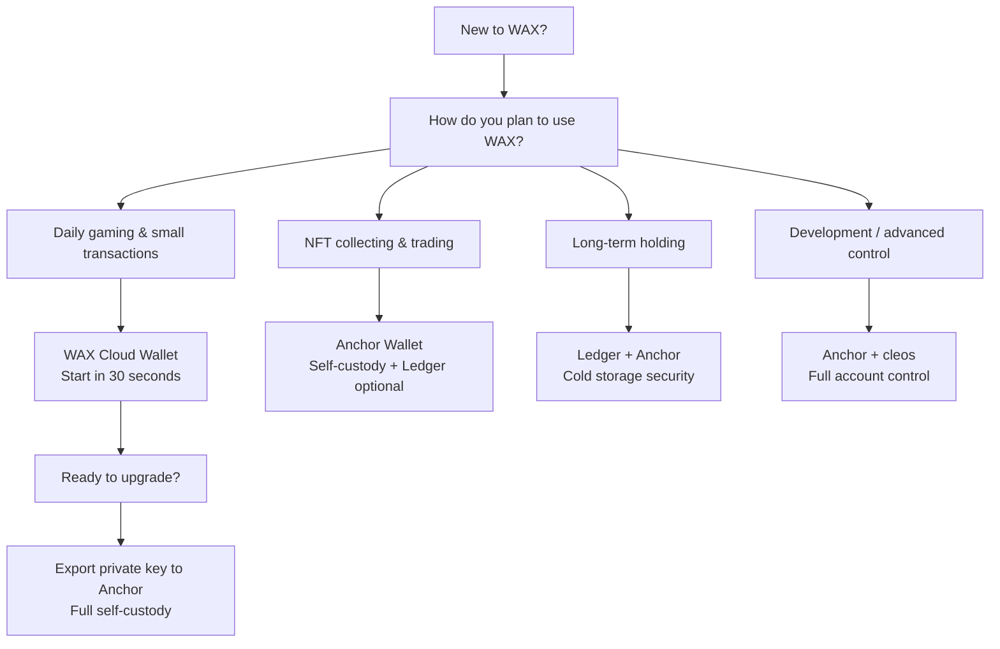

## O que é uma Carteira Crypto?

Uma carteira crypto não "armazena" suas criptomoedas — ela armazena as chaves privadas que provam que você é o dono delas. Pense como um chaveiro: a chave (privada) abre a porta e permite movimentar o que está dentro, mas o cofre em si está na blockchain.

Toda carteira gera um par de chaves:
- **Chave pública:** seu endereço para receber fundos (como um número de conta)
- **Chave privada:** sua senha mestra para enviar fundos (nunca compartilhe)

Para WAX especificamente, sua carteira é a porta de entrada para o ecossistema: comprar cartelas, jogar como CryptoBingo, colecionar NFTs e negociar em marketplaces.

## Tipos de Carteira

**Carteiras Custodiais:** um terceiro guarda suas chaves privadas. Você confia na segurança da empresa. Fácil de começar, mas não tem controle total sobre sua conta.

**Modelo Híbrido (passkeys):** serviços como o novo WAX Cloud Wallet (2026) usam passkeys (Face ID / Touch ID) para proteger sua chave privada no seu dispositivo. Você pode opcionalmente salvar uma frase mnemônica de 12 palavras e exportar a chave privada. Isso não é mais puramente custodial — oferece opções de recuperação e a possibilidade de migrar para autocustódia total depois.

**Autocustódia:** você gera e controla suas chaves privadas. Exemplo: Anchor Wallet. Controle total, responsabilidade total. Se perder sua frase semente, ninguém pode recuperar sua conta — nem mesmo o provedor da carteira.

**Carteira Quente vs Carteira Fria:** carteiras quentes ficam conectadas à internet (práticas para jogos, uso diário). Carteiras frias são dispositivos offline como Ledger (máxima segurança para holdings de longo prazo).

## WAX Cloud Wallet (My Cloud Wallet)

O novo WAX Cloud Wallet (lançado em março de 2026) é uma grande atualização. Ele usa **passkeys** (Face ID, Touch ID, impressão digital ou PIN) em vez de email e senha. Sua chave privada permanece criptografada no seu dispositivo, protegida pelo enclave seguro do dispositivo.

### Principais Recursos

- **Login com passkey:** autentique-se com biometria — sem senhas para lembrar
- **Frase mnemônica de 12 palavras:** gerada na criação da conta para backup e recuperação
- **Exportação de chave privada:** você pode exportar sua chave privada e importá-la no Anchor a qualquer momento
- **Vault (Beta):** sessão de assinatura persistente — confirme sua passkey uma vez e assine múltiplas transações sem prompts repetidos. Pode ser desativado em Configurações se preferir confirmar cada transação
- **Recuperação de conta:** importe sua frase mnemônica em um novo dispositivo para recriar sua passkey. Suporta iCloud Keychain e Google Password Manager
- **Criação de conta gratuita:** sem taxa de criação de conta WAX
- **Migração da carteira legada:** fluxo de migração guiado com Soft Claim (mantém alguma integração Cloud Wallet) ou Hard Claim (posse total das chaves)
- **Suporte mobile:** iOS e Android

### Prós

- Integração mais rápida — menos de 30 segundos
- Segurança biométrica
- Gratuito para criar e usar
- Recuperável com frase mnemônica
- Exportável para carteiras de autocustódia
- Experiência WAX nativa

### Contras

- Dependente de dispositivo — perder todos os dispositivos sem a frase mnemônica significa perder o acesso
- Dependente de navegador no desktop (Chrome, Safari, Brave, Edge recomendados; veja [docs WAX para compatibilidade](https://docs.wax.io/learn/getting-started/mycloudwallet/troubleshooting))
- Conflitos de passkey com gerenciadores de senha concorrentes (desative temporariamente Dashlane etc. durante a configuração)

### Quando Escolher WAX Cloud Wallet

> Melhor para iniciantes, jogadores casuais e qualquer um que queira começar a jogar na WAX em menos de um minuto. Comece aqui, upgrade depois.

## Anchor Wallet

[Anchor Wallet](https://greymass.com/anchor) é uma carteira desktop e mobile open-source da Greymass. Projetada para autocustódia total em blockchains baseadas em Antelope, incluindo WAX, Vaulta (antiga EOS), Telos, FIO e Proton.

### Principais Recursos

- **Frase semente de 12 palavras:** você gera e controla. Anchor nunca vê suas chaves privadas
- **Armazenamento local criptografado AES-256:** suas chaves são criptografadas no seu dispositivo
- **Integração com hardware wallet Ledger:** conecte seu Ledger Nano S, Nano X ou Stax para assinatura em cold storage (apenas desktop)
- **Multi-chain:** gerencie contas em WAX, Vaulta, Telos e mais a partir de um único app
- **Greymass Fuel:** transações gratuitas (CPU limitado) em redes Antelope suportadas
- **Gerenciamento de conta:** visualize recursos (CPU, NET, RAM), faça stake de tokens, gerencie permissões
- **Interação com dApps:** faça login em dApps WAX como CryptoBingo, NeftyBlocks, AtomicHub
- **Desktop e Mobile:** Windows, macOS, Linux, iOS, Android

### Prós

- Controle total das suas chaves privadas
- Código aberto (código auditável)
- Suporte a hardware wallet (Ledger)
- Multi-chain
- Ferramentas ricas de gerenciamento de conta
- Transações gratuitas via Fuel

### Contras

- Configuração leva mais tempo (5-10 minutos)
- Você é o único responsável pela frase semente — sem recuperação se perdida
- Sem opção de passkey/biometria (requer senha para desbloquear)
- Suporte a Ledger apenas no desktop

### Quando Escolher Anchor

> Melhor para usuários que querem controle total, possuem tokens WAX significativos, colecionam NFTs ou precisam de gerenciamento avançado de conta.

## Outras Opções de Carteira

### Hardware Wallet Ledger

Dispositivos [Ledger](https://www.ledger.com/) (Nano S Plus, Nano X, Stax) oferecem segurança de cold storage para contas WAX. Suas chaves privadas nunca saem do dispositivo.

- Instale o **app EOS** no seu Ledger (não há um app WAX dedicado — WAX usa a mesma curva elíptica que EOS)
- Conecte ao Anchor Wallet no desktop para interagir com dApps WAX
- Use para holdings de longo prazo e contas de alto valor
- Não é ideal para jogos diários (requer dispositivo físico para assinar)

**Nota:** Trezor Model T também suporta WAX através do app EOS.

### Wombat Wallet

Uma carteira de navegador multi-chain comumente usada com jogos WAX e plataformas NFT. Suporta WAX, Ethereum, BNB Chain e Polygon. Boa alternativa para usuários que querem uma única carteira em múltiplos ecossistemas.

### cleos (Linha de Comando)

Para desenvolvedores e operadores. A ferramenta oficial de linha de comando WAX para interagir diretamente com a blockchain. Use para scripts, automação e operações avançadas de conta.

## Tabela Comparativa

| Recurso | WAX Cloud Wallet | Anchor Wallet | Ledger + Anchor | Wombat |
|---|---|---|---|---|
| **Custódia** | Híbrida (passkeys) | Autocustódia | Cold storage (autocustódia) | Autocustódia |
| **Tempo de setup** | ~30 segundos | ~5 minutos | ~15 minutos | ~2 minutos |
| **Segurança** | Biometria + passkey | Criptografia AES-256 | Hardware (chaves offline) | Local criptografado |
| **Frase semente** | Opcional (12 palavras) | Obrigatória (12 palavras) | Obrigatória (24 palavras) | Obrigatória (12 palavras) |
| **Recuperação** | Mnemônico + passkey | Frase semente | Frase semente (recuperação Ledger) | Frase semente |
| **Suporte Ledger** | Não | Sim (desktop) | Nativo | Não |
| **Multi-chain** | Apenas WAX | WAX, Vaulta, Telos, FIO, Proton | Via Anchor | WAX, ETH, BNB, Polygon |
| **Transações gratuitas** | Sim | Sim (Fuel) | Via Anchor | Não |
| **Melhor para** | Iniciantes, jogos | Usuários avançados, colecionadores | Armazenamento de longo prazo | Usuários cross-chain |
| **Plataforma** | Navegador web | Desktop + Mobile | Desktop + Ledger | Extensão de navegador |

## Qual Carteira Escolher?



### Recomendações Rápidas

| Seu perfil | Carteira recomendada |
|---|---|
| Iniciante total, só quer jogar | WAX Cloud Wallet |
| Joga diariamente, buy-ins pequenos | WAX Cloud Wallet |
| Joga + tem NFTs acima de $100 | Anchor Wallet |
| Colecionador / trader sério | Anchor Wallet |
| Holdings WAX grandes (>$1000) | Ledger + Anchor |
| Desenvolvedor / power user | Anchor + cleos |
| Usa múltiplas blockchains diariamente | Wombat ou Anchor |

## Como Conectar Sua Carteira ao CryptoBingo

Conectar sua carteira ao CryptoBingo é simples:

1. Clique em **Connect Wallet** no canto superior direito
2. Escolha **WAX Cloud Wallet** ou **Anchor**
3. Confirme a conexão na sua carteira
4. Pronto — você já pode comprar cartelas e jogar

Suas cartelas, vitórias e prêmios estão vinculados à sua conta na blockchain WAX — comprovavelmente justos e verificáveis on-chain.

## FAQ

```json
{
  "@context": "https://schema.org",
  "@type": "FAQPage",
  "mainEntity": [
    {
      "@type": "Question",
      "name": "Qual carteira WAX é melhor para iniciantes?",
      "acceptedAnswer": {
        "@type": "Answer",
        "text": "WAX Cloud Wallet é a melhor escolha para iniciantes. Usa passkeys (Face ID/Touch ID) em vez de senhas, leva menos de 30 segundos para configurar e é gratuito. Você pode sempre exportar sua chave privada para o Anchor depois, quando quiser mais controle."
      }
    },
    {
      "@type": "Question",
      "name": "O WAX Cloud Wallet é seguro?",
      "acceptedAnswer": {
        "@type": "Answer",
        "text": "Sim. O novo WAX Cloud Wallet (2026) usa passkeys — sua chave privada é protegida pelo enclave seguro do seu dispositivo e nunca sai dele. Você pode opcionalmente salvar uma frase mnemônica de 12 palavras para recuperação e exportar sua chave privada. É um modelo híbrido: não é mais puramente custodial, mas também não é autocustódia total a menos que você exporte a chave."
      }
    },
    {
      "@type": "Question",
      "name": "Posso usar uma hardware wallet Ledger com WAX?",
      "acceptedAnswer": {
        "@type": "Answer",
        "text": "Sim. Instale o app EOS no seu dispositivo Ledger (WAX usa o mesmo algoritmo de chave), depois conecte ao Anchor Wallet no desktop. Suas chaves privadas permanecem no Ledger — o Anchor atua como intermediário, e cada transação precisa ser fisicamente confirmada pressionando os botões do Ledger. Esta é a forma mais segura de armazenar tokens WAX."
      }
    },
    {
      "@type": "Question",
      "name": "Como migrar do WAX Cloud Wallet para o Anchor?",
      "acceptedAnswer": {
        "@type": "Answer",
        "text": "Duas formas: (1) Exporte sua chave privada do WAX Cloud Wallet e importe diretamente no Anchor Desktop via 'Import Private Key'. (2) Gere novas chaves no Anchor primeiro, depois use o fluxo Hard Claim do WAX Cloud Wallet para atribuir essas chaves à sua conta. O método 1 é mais simples para a maioria dos usuários."
      }
    }
  ]
}
```

## Dicas de Segurança

- **Frase semente:** nunca a digitalize. Escreva no papel e guarde em local seguro — um cofre à prova de fogo é ainda melhor. Nunca fotografe ou armazene em notas na nuvem
- **2FA:** habilite autenticação de dois fatores onde disponível
- **Sites falsos:** sempre verifique a URL antes de conectar sua carteira. Salve os sites oficiais nos favoritos
- **Nunca compartilhe chaves privadas:** nenhum serviço legítimo — incluindo CryptoBingo — jamais pedirá sua frase semente ou chave privada
- **Comece pequeno:** se é novo, comece com valores pequenos. Familiarize-se com a carteira antes de depositar valores significativos
- **Múltiplos dispositivos:** se usar WAX Cloud Wallet, salve a frase mnemônica e considere adicionar sua passkey a um segundo dispositivo
- **Usuários Ledger:** sempre verifique o endereço de destino na tela do seu Ledger antes de assinar uma transação

## Resumo

| Carteira | Melhor para | Nível de Segurança | Tempo de Setup |
|---|---|---|---|
| WAX Cloud Wallet | Iniciantes, jogos diários | Bom (passkeys) | 30 segundos |
| Anchor Wallet | Usuários avançados, colecionadores | Forte (autocustódia) | 5 minutos |
| Ledger + Anchor | Holdings de longo prazo | Máximo (cold storage) | 15 minutos |
| Wombat | Usuários cross-chain | Bom (autocustódia) | 2 minutos |

**Nossa recomendação:** comece com WAX Cloud Wallet. Jogue CryptoBingo, familiarize-se com o ecossistema. Quando acumular mais tokens ou quiser controle total, exporte sua chave privada para o Anchor. Para holdings significativas, adicione um Ledger para cold storage.

Pronto para começar? Siga nosso [tutorial passo a passo para criar sua primeira carteira WAX](/blog/criar-carteira-wax).

---
*Verified: July 2026. All information validated against official WAX documentation (docs.wax.io), Anchor Wallet (greymass.com), and WAX io official announcements. Passkeys, Vault, hard claim flow, Ledger integration — all confirmed current as of Q3 2026.*
