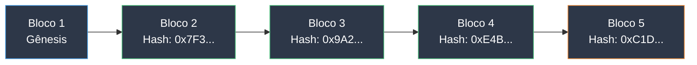

## O Que é uma Blockchain?

Imagine um caderno que todos podem ver e ninguém pode apagar. Cada página nova (bloco) contém um conjunto de transações e uma referência à página anterior. Esse caderno não está guardado na gaveta de ninguém — cópias dele existem em milhares de computadores ao redor do mundo simultaneamente.

Essa é uma blockchain: um livro-razão digital compartilhado, descentralizado e imutável.

Toda vez que alguém compra um ticket de bingo, um sorteio acontece ou um prêmio é pago, isso é registrado neste caderno. Qualquer um pode consultá-lo. Ninguém pode alterar o que foi escrito.

## Como Funciona

### Blocos e a Cadeia

Cada bloco é como uma página do caderno:

- Contém transações (compras de tickets, sorteios, prêmios)
- Tem um carimbo de data/hora e uma impressão digital única (hash)
- Referencia a impressão digital do bloco anterior

Quando alguém tenta alterar um bloco antigo, a impressão digital muda e a corrente quebra — todos os nós detectam a adulteração imediatamente.

Cada bloco trava o anterior no lugar. Alterar um bloco significa recalcular todos os blocos seguintes — em milhares de computadores. É isso que torna a blockchain à prova de adulteração.

### Consenso: Acordo Sem Chefe

Antes de um novo bloco ser adicionado, a rede inteira precisa concordar que ele é válido. Isso se chama consenso. Na WAX, a blockchain usada pelo CryptoBingo, esse processo leva aproximadamente 1,5 segundos.

Nenhum servidor central controla os dados. Milhares de computadores independentes (nós) mantêm cópias idênticas do livro-razão. Para fraudar o sistema, um atacante precisaria controlar mais da metade da rede — praticamente impossível em blockchains estabelecidas como a WAX.

### Imutabilidade: Escrito na Pedra

Uma vez que uma transação é registrada e confirmada, ela não pode ser alterada ou removida. Para o CryptoBingo, isso significa que cada resultado de sorteio, cada pagamento de prêmio e cada compra de ticket é registrado permanentemente. Ninguém — nem mesmo a plataforma — pode alterar o resultado depois do fato.

### Transparência: Aberto para Inspeção

Todas as transações são públicas. Qualquer um pode verificar quantos tickets foram vendidos, quanto foi pago em prêmios e se os resultados foram justos. Você não precisa confiar na casa — os dados estão disponíveis para qualquer um verificar.

## Mitos Comuns Sobre Blockchain

**"Blockchain é só criptomoeda."** Não. Criptomoeda é uma aplicação da blockchain — como email é uma aplicação da internet. Blockchain é infraestrutura para confiança, dinheiro é apenas o primeiro caso de uso.

**"Blockchain é lenta."** Depende do design. A WAX processa transações em cerca de 1,5 segundos com zero taxas. A WAX Cloud Wallet permite que qualquer um crie uma conta em 30 segundos usando passkeys (Face ID / Touch ID). Muitas pessoas usam blockchain sem nem saber.

**"Blockchain é complicada de usar."** A interface do usuário parece qualquer site. A blockchain roda invisível por baixo. Você clica em "comprar ticket" e a tecnologia cuida do resto.

**"Blockchain consome energia enorme."** Nem todas as blockchains são Bitcoin. A WAX é neutra em carbono desde 2021. A energia por transação é insignificante comparada a chains de proof-of-work.

## Blockchain Além da Criptomoeda

A tecnologia blockchain tem aplicações muito além do dinheiro digital:

- **Jogos:** resultados aleatórios comprovadamente justos, pagamentos automáticos de prêmios, propriedade verificável de itens
- **Cadeia de suprimentos:** rastrear produtos da fábrica à loja com registros à prova de adulteração
- **Identidade:** identidade autossoberana onde você controla seus dados pessoais
- **Votação:** eleições transparentes e auditáveis
- **Imóveis:** registros de propriedade imutáveis e transferências programáveis

Para jogos em particular, a blockchain elimina o problema fundamental de confiança: os jogadores não precisam mais confiar que a plataforma é honesta. O código garante a honestidade.

## Por Que o CryptoBingo Usa Blockchain

O bingo online tem um problema de confiança. Em plataformas tradicionais, o operador controla o gerador de números aleatórios, o pool de prêmios e o sistema de pagamento. Os jogadores precisam confiar que o operador é honesto.

O CryptoBingo resolve isso colocando o jogo inteiro na blockchain WAX:

1. **Sorteios comprovadamente justos:** cada sorteio usa um gerador de números aleatórios criptográfico com três fontes de entropia independentes. Após cada partida, qualquer um pode verificar que o resultado não foi manipulado. Veja nosso [guia de provably fair](/blog/provably-fair) para os detalhes técnicos.

2. **Prêmios automáticos:** quando você ganha, o pagamento é processado pelo smart contract instantaneamente. Sem aprovação humana, sem atrasos, sem "processaremos seu saque em 3-5 dias úteis."

3. **Zero taxas ocultas:** as regras do jogo estão codificadas no smart contract e visíveis para todos. Preços dos tickets, estruturas de prêmios e regras de pagamento são imutáveis.

4. **Transparência total:** cada compra, cada sorteio, cada prêmio é registrado na blockchain pública. Você pode verificar o histórico completo de qualquer partida. Veja nosso [guia de segurança](/blog/cryptobingo-e-seguro) para mais.

5. **Nenhuma confiança necessária:** você não precisa confiar no time do CryptoBingo. O código é a garantia. Como diz o ditado: *"Não confie, verifique."*

## Perguntas Frequentes

### Qual é a diferença entre blockchain e um banco de dados comum?

Um banco de dados comum é controlado por uma organização. Eles podem alterar dados, deletar registros ou interromper o serviço. Uma blockchain é controlada por milhares de nós independentes. Nenhuma entidade controla os dados, registros não podem ser deletados e o serviço continua enquanto pelo menos um nó estiver rodando.

### Preciso entender blockchain para usar o CryptoBingo?

Não. Você usa o site como qualquer outra plataforma de bingo. A blockchain roda nos bastidores. Se quiser verificar resultados, pode usar exploradores de blocos públicos sem nenhum software especial.

### Jogos em blockchain são legais?

Jogos em blockchain existem em uma área cinzenta regulatória em muitas jurisdições. O CryptoBingo opera em conformidade com as regulamentações aplicáveis. Sempre verifique as leis locais antes de participar de qualquer plataforma de jogos baseada em blockchain.

### Como começo na WAX?

Crie uma WAX Cloud Wallet em mycloudwallet.com. O processo leva cerca de dois minutos — escolha um nome de usuário, configure uma passkey (Face ID ou digital) e sua carteira está pronta. Sem email, sem senha, sem seed phrase para uso básico. Siga nosso [tutorial de carteira](/tutorials/criar-carteira-wax) para instruções passo a passo.

## Resumo

Blockchain é a infraestrutura que torna o CryptoBingo possível: sorteios justos, prêmios instantâneos, transparência total e zero necessidade de confiança. Você não precisa entender todos os detalhes técnicos para se beneficiar — assim como você não precisa entender TCP/IP para usar a internet.

A diferença é que com blockchain, você pode verificar tudo por si mesmo. Cada ticket, cada sorteio, cada prêmio está registrado no caderno público — visível para todos, alterável por ninguém.

Pronto para jogar? [Crie sua carteira WAX](/tutorials/criar-carteira-wax) e ganhe seu primeiro ticket.

---

*Verified: July 2026. All information validated for accuracy and currency.*
