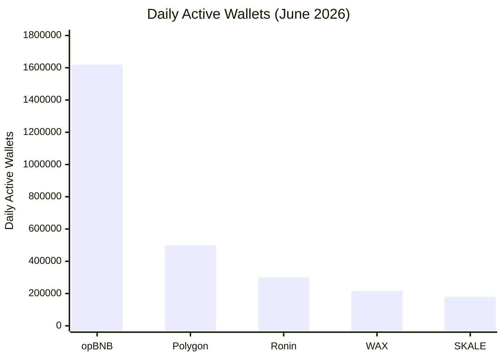

## O Que É a Blockchain WAX?

WAX (Worldwide Asset eXchange) é uma blockchain de camada 1 construída especificamente para jogos, NFTs e ativos digitais. Diferente de blockchains de propósito geral que tentam fazer de tudo, a WAX é otimizada para o que realmente importa em jogos: velocidade, taxas zero e adoção em massa.

Lançada em 2019, a WAX roda sobre o **framework Antelope** (antigo EOSIO) — a mesma tecnologia por trás de Telos, Vaulta (antiga EOS), UX Network, Proton, Ultra e FIO. Essa base compartilhada significa que a WAX herda uma infraestrutura testada em batalha, mantendo seu próprio foco: ser a blockchain mais acessível para usuários comuns.

**Principais diferenciais:**
- **Taxas de gas zero** — jogadores nunca pagam custos de transação
- **Blocos a cada 1,5 segundo** com finalidade instantânea
- **Carbono neutra** desde 2021 (certificada pela Climate Care)
- **Criação de conta gratuita** — sem barreiras, sem cartão de crédito
- **Carteiras com passkey** — Face ID / Touch ID no lugar de frases-semente

## O Que Torna a WAX Especial?

### Taxas de Gas Zero

No Ethereum, uma única transação pode custar de US$ 1 a US$ 50 dependendo da congestão da rede. Na WAX, as transações são gratuitas. Em vez de queimar taxas, a WAX usa um modelo baseado em recursos onde os usuários fazem stake de tokens WAXP para CPU e NET — ou usam o sistema gratuito PowerUp, introduzido em 2026 após a remoção da taxa de 5 WAXP para criação de conta.

Para jogos, isso é revolucionário. Jogadores podem comprar bilhetes, resgatar prêmios e negociar ativos milhares de vezes sem se preocupar com custos de gas. O atrito que inviabiliza microtransações em outras blockchains simplesmente não existe na WAX.

### Finalidade em 1,5 Segundo

Blocos são produzidos a cada 1,5 segundos usando consenso DPoS (Delegated Proof of Stake). Com a atualização Savanna (Antelope Spring v1.0, setembro de 2024), a finalidade caiu de ~3 minutos para aproximadamente 1 segundo — uma melhoria de 100×.

Compare com:
- **Ethereum:** ~12 segundos por bloco, ~2 minutos para finalidade probabilística
- **Bitcoin:** ~10 minutos por bloco, ~1 hora para confirmação completa
- **Polygon:** ~2 segundos, mas a finalidade depende do settlement do Ethereum

A WAX oferece liquidação quase instantânea — um requisito crítico para jogos em tempo real, onde esperar minutos por uma confirmação de transação quebra a experiência do usuário.

### Carbono Neutra Desde 2021

A WAX é uma das poucas blockchains carbono neutro, certificada pela Climate Care. Seu mecanismo DPoS é 125.000× mais eficiente energeticamente que sistemas Proof of Work. Toda a rede WAX consome aproximadamente a mesma energia que 5,5 residências americanas por ano, enquanto compensa mais de 211 toneladas de CO₂.

### Criação de Conta Gratuita

Em março de 2026, a WAX removeu a barreira de 5 WAXP para criação de conta, tornando o processo completamente gratuito. Combinada com a nova Cloud Wallet baseada em passkey, qualquer pessoa pode criar uma conta WAX em menos de 30 segundos usando Face ID ou Touch ID — sem frases-semente, sem e-mail, sem senhas.

## Números Que Importam

A WAX consistentemente figura entre as principais blockchains de jogos em atividade real de usuários:

- **215.650 carteiras ativas diárias** (junho de 2026, Gate News) — 5ª entre chains de jogos, crescimento de 11,98% em 30 dias
- **570–687 milhões de transações por trimestre** — mais que qualquer outra chain de jogos por usuário
- **Mais de 15 milhões de usuários** e mais de **30.000 dApps** — um dos maiores ecossistemas da Web3
- **Mais de 23 milhões de transações por dia** — vazão sustentada que prova a escala da infraestrutura
- **3ª blockchain mais ativa para jogos** em número de carteiras em 2024–2025 (DappRadar)

**Fontes:** DappRadar, Gate News (junho de 2026), WAX.io

### Como a WAX se Compara

*Fonte: Gate News, junho de 2026*

## WAX vs Concorrentes

| Característica | WAX | opBNB | Polygon | Ronin | Vaulta |
|----------------|-----|-------|---------|-------|--------|
| Taxas de transação | Zero | Baixas ($0,001) | Baixas ($0,01) | Baixas ($0,001) | Baixas ($0,001) |
| Tempo de bloco | 1,5s | ~1s | ~2s | ~3s | ~1s |
| Finalidade | ~1s | ~1s | ~2s (checkpoint) | ~3s | ~1s |
| DAU (jun/2026) | 215K | 1,62M | ~500K | ~300K | ~50K |
| Tx/trimestre | ~687M | ~500M | ~400M | ~200M | ~100M |
| Carbono neutro | Sim | Não | Parcial | Não | Não |
| Cloud Wallet (passkeys) | Sim (30s) | Não | Não | Não | Não |
| Antelope nativo | Sim | Não | Não | Não | Sim |
| Foco em jogos | Primário | Geral | Geral | Jogos | Bancário |
| Criação de conta grátis | Sim | Não | Não | Não | Não |

A WAX vence em **transações por carteira**: cada usuário WAX realiza em média ~599 ações on-chain por mês — mais que qualquer chain concorrente. Essa é a métrica que importa para engajamento real de usuários, não apenas atividade especulativa.

## Ecossistema WAX

### Alien Worlds

O jogo blockchain mais jogado de todos os tempos, com **420.000 carteiras ativas mensais** (Q3 2025) e mais de 90.000 contas ativas diárias. Jogadores mineram Trilium (TLM), competem por governança planetária e participam de um metaverso orientado por DAO que agora abrange vários jogos, incluindo Mayhem, Outlaw Troopers e Planetary Defense.

### AtomicHub

O maior marketplace de NFTs na WAX, onde usuários compram, vendem e criam NFTs com taxas próximas de zero. Apenas no Q4 2024, a WAX processou US$ 935.328 em volume de negociação de NFTs em 316.080 vendas.

### NeftyBlocks

Uma plataforma de criação de NFTs com ferramentas de gamificação — criadores podem lançar pacotes, definir royalties e construir vitrines personalizadas sem escrever código.

### My Cloud Wallet (antiga WAX Cloud Wallet)

A carteira que torna a blockchain invisível. Desde março de 2026, usa passkeys (Face ID / Touch ID) em vez de senhas ou frases-semente para uso cotidiano. Um mnemônico de 12 palavras serve como backup de recuperação, mas 99% dos usuários nunca precisarão vê-lo. A criação de conta leva 30 segundos, e o novo recurso Vault (2026) cria sessões de assinatura persistentes, permitindo que os usuários joguem sem aprovar cada transação individualmente.

Recursos empresariais como WharfKit SDK e o Cloud Wallet Bridge (com suporte a TON, Solana, Ethereum, Polygon, BNB Smart Chain e Base) fazem da WAX a blockchain de jogos mais conectada.

## Ponte WAX-TON

Lançada em 2024, a ponte WAX-TON conecta a WAX ao ecossistema TON (Telegram Open Network), dando à WAX acesso aos 900 milhões de usuários ativos mensais do Telegram. Os usuários podem transferir ativos entre WAX e TON perfeitamente através do Cloud Wallet Bridge.

Isso posiciona a WAX como a porta de entrada para **jogos sociais mobile-first** — a interseção entre ativos blockchain e a maior plataforma de mensagens do mundo.

## Por Que WAX para o CryptoBingo?

Cada sorteio do CryptoBingo precisa ser rápido, barato e verificável on-chain. A WAX entrega todos os três:

- **Sorteios instantâneos:** blocos a cada 1,5 segundo com finalidade de ~1 segundo — os prêmios são confirmados antes mesmo de o jogador terminar de comemorar
- **Taxas zero:** jogadores compram bilhetes e recebem prêmios sem pagar gas — sem atrito de microtransação
- **Comprovadamente justo:** o oráculo de RNG da WAX (orng.wax) usa assinaturas RSA de 2048 bits, e o contrato verifica cada resultado on-chain
- **Carteiras com passkey:** qualquer usuário cria uma carteira em 30 segundos e começa a jogar — sem conhecimento de crypto necessário
- **Ecossistema maduro:** 15 milhões de usuários, 30K dApps, infraestrutura testada em batalha

Para uma plataforma de bingo comprovadamente justa, a WAX é a única chain que elimina todas as barreiras entre um usuário casual e um jogo on-chain verificável.

## FAQ

### A WAX é realmente gratuita?

Sim. Transações na WAX custam taxa zero. Em vez de pagar gas, os usuários fazem stake de WAXP para recursos de CPU e NET, ou usam o sistema gratuito PowerUp. Desde março de 2026, até a criação de conta é gratuita.

### Preciso de experiência em crypto para usar a WAX?

Não. A My Cloud Wallet usa passkeys (Face ID / Touch ID) — você nunca vê ou gerencia chaves privadas. A criação de conta leva 30 segundos e a interface se parece com qualquer site. A blockchain roda de forma invisível.

### Como a WAX se compara ao Ethereum para jogos?

A WAX é mais rápida (1,5s vs 12s por bloco), mais barata (taxas zero vs US$ 1–50 de gas) e mais eficiente energeticamente (125.000× menos energia que o PoW do Ethereum). O Ethereum tem mais liquidez e ferramentas DeFi, mas para UX de jogos, a WAX é superior.

### A WAX é segura?

A WAX usa Delegated Proof of Stake com 21 produtores de bloco eleitos. A rede está em operação desde 2019 sem incidentes graves de segurança. A atualização de consenso Savanna adicionou agregação de assinaturas BLS e finalidade de 1 segundo, fortalecendo ainda mais o modelo de segurança.

### O que posso fazer com a WAX?

Jogar jogos blockchain (CryptoBingo, Alien Worlds, Splinterlands), negociar NFTs (AtomicHub), criar colecionáveis digitais (NeftyBlocks), fazer stake de tokens para recompensas e conectar ativos a outras chains (TON, Solana, Ethereum, Polygon).

## Riscos Honestos

A WAX tem uma forte dependência do Alien Worlds, que representa uma parcela significativa da atividade on-chain e ~49% do TVL. Um declínio no Alien Worlds impactaria materialmente as métricas de toda a chain.

O modelo de taxas zero exige staking de WAXP para CPU/NET — algo que pode confundir iniciantes que esperam transações verdadeiramente gratuitas sem entender o modelo de recursos subjacente.

O DAU caiu no Q4 2024 (~191K) antes de se recuperar ao longo de 2025–2026. O crescimento da chain é estável, mas não explosivo comparado aos 1,62M de DAU da opBNB.

Apesar dessas considerações, a WAX continua sendo a blockchain mais acessível para jogos casuais, com o ecossistema de jogos mais maduro e a melhor experiência de integração de usuários na Web3.

## Resumo

WAX é a blockchain que torna os jogos on-chain acessíveis: taxas zero, finalidade quase instantânea, operações carbono neutro e uma carteira que funciona como um aplicativo normal. Com 215 mil usuários ativos diários, 15 milhões de contas e o ecossistema de jogos mais rico fora do Ethereum, a WAX é a infraestrutura que impulsiona a próxima geração de jogos verificáveis e de propriedade dos jogadores.

Crie sua carteira WAX gratuita em 30 segundos e experimente jogos on-chain sem atrito.

---
*Verified: July 2026. All information validated for accuracy and currency.*
