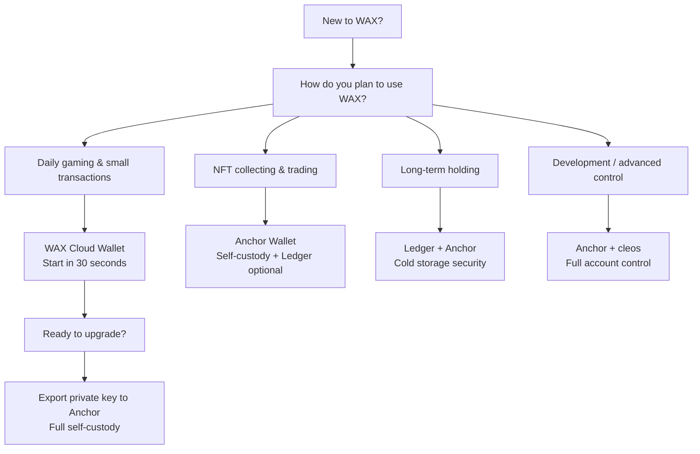

## 什么是加密钱包？

加密钱包并不"存储"你的加密货币——它存储证明你拥有这些货币的私钥。可以把它想象成一个钥匙串：钥匙（私钥）打开门，让你可以移动里面的东西，但保险箱本身在区块链上。

每个钱包都会生成一对密钥：
- **公钥：** 你接收资金的地址（类似于账号）
- **私钥：** 你发送资金的万能密码（切勿分享）

具体到WAX，你的钱包是进入生态系统的门户：购买彩票、玩CryptoBingo等游戏、收藏NFT以及在市场上交易。

## 钱包类型

**托管钱包：** 第三方保管你的私钥。你信任该公司的安全性。易于上手，但你无法完全控制自己的账户。

**混合模式（passkeys）：** 像新的WAX Cloud Wallet（2026）这样的服务使用passkeys（Face ID / Touch ID）在你的设备上保护私钥。你可以选择保存12个单词的助记词并导出私钥。这不再是纯粹的托管模式——它为你提供了恢复选项以及日后迁移到完全自主保管的能力。

**自主保管：** 你生成并控制自己的私钥。例如：Anchor Wallet。完全控制，完全责任。如果你丢失了种子短语，没有人可以恢复你的账户——包括钱包提供商。

**热钱包 vs 冷钱包：** 热钱包保持互联网连接（适合游戏、日常使用）。冷钱包是Ledger等离线设备（长期持有的最高安全性）。

## WAX Cloud Wallet（My Cloud Wallet）

新的WAX Cloud Wallet（2026年3月发布）是一次重大升级。它使用**passkeys**（Face ID、Touch ID、指纹或PIN）代替电子邮件和密码。你的私钥在你的设备上加密存储，由设备的安全区域保护。

### 主要特点

- **Passkey登录：** 使用生物识别认证——无需记住密码
- **12单词助记词：** 在创建账户时生成，用于备份和恢复
- **私钥导出：** 你可以随时导出私钥并导入到Anchor
- **Vault（Beta）：** 持久签名会话——确认一次passkey，然后签署多笔交易而无需重复提示。可在设置中禁用，如果你更喜欢确认每笔交易
- **账户恢复：** 在新设备上导入助记词以重新创建passkey。支持iCloud Keychain和Google Password Manager
- **免费创建账户：** 无需WAX账户创建费
- **从旧版钱包迁移：** 引导迁移流程，可选择Soft Claim（保留部分Cloud Wallet集成）或Hard Claim（完全拥有密钥）
- **移动端支持：** iOS和Android

### 优点

- 最快上手——不到30秒
- 生物识别安全
- 免费创建和使用
- 可通过助记词恢复
- 可导出到自主保管钱包
- 原生WAX体验

### 缺点

- 依赖设备——丢失所有设备且没有助记词意味着失去访问权限
- 桌面端依赖浏览器（推荐Chrome、Safari、Brave、Edge；参见[WAX文档了解兼容性](https://docs.wax.io/learn/getting-started/mycloudwallet/troubleshooting)）
- Passkey与竞争密码管理器冲突（设置期间暂时禁用Dashlane等）

### 何时选择WAX Cloud Wallet

> 最适合初学者、休闲玩家以及任何希望在一分钟内开始在WAX上玩耍的人。从这里开始，以后再升级。

## Anchor Wallet

[Anchor Wallet](https://greymass.com/anchor) 是Greymass开发的一款开源桌面和移动钱包。为基于Antelope的区块链提供完全自主保管，包括WAX、Vaulta（原EOS）、Telos、FIO和Proton。

### 主要特点

- **12单词种子短语：** 你生成并控制它。Anchor永远不会看到你的私钥
- **AES-256加密本地存储：** 你的密钥在你的设备上加密
- **Ledger硬件钱包集成：** 连接你的Ledger Nano S、Nano X或Stax进行冷存储签名（仅桌面端）
- **多链：** 在WAX、Vaulta、Telos等之间通过一个应用管理账户
- **Greymass Fuel：** 在支持的Antelope网络上免费交易（有限CPU时间）
- **账户管理：** 查看资源（CPU、NET、RAM）、质押代币、管理权限
- **dApp交互：** 登录CryptoBingo、NeftyBlocks、AtomicHub等WAX dApp
- **桌面和移动端：** Windows、macOS、Linux、iOS、Android

### 优点

- 完全控制你的私钥
- 开源（代码可审计）
- 支持硬件钱包（Ledger）
- 多链
- 丰富的账户管理工具
- 通过Fuel免费交易

### 缺点

- 设置时间较长（5-10分钟）
- 你全权负责种子短语——如果丢失则无法恢复
- 没有passkey/生物识别选项（需要密码解锁）
- Ledger支持仅限于桌面端

### 何时选择Anchor

> 最适合希望完全控制、持有大量WAX代币、收藏NFT或需要高级账户管理的用户。

## 其他钱包选项

### Ledger硬件钱包

[Ledger](https://www.ledger.com/) 设备（Nano S Plus、Nano X、Stax）为WAX账户提供冷存储安全。你的私钥永远不会离开设备。

- 在Ledger上安装**EOS应用**（没有专用的WAX应用——WAX使用与EOS相同的椭圆曲线）
- 在桌面端连接到Anchor Wallet以与WAX dApp交互
- 用于长期持有和高价值账户
- 不适合日常游戏（需要物理设备签名）

**注意：** Trezor Model T也通过EOS应用支持WAX。

### Wombat钱包

一种多链浏览器钱包，常用于WAX游戏和NFT平台。支持WAX、Ethereum、BNB Chain和Polygon。适合希望在多个生态系统中使用单一钱包的用户。

### cleos（命令行）

面向开发者和运维人员。官方的WAX命令行工具，用于直接与区块链交互。用于脚本编写、自动化和高级账户操作。

## 对比表格

| 特性 | WAX Cloud Wallet | Anchor Wallet | Ledger + Anchor | Wombat |
|---|---|---|---|---|
| **托管方式** | 混合（passkeys） | 自主保管 | 冷存储（自主保管） | 自主保管 |
| **设置时间** | ~30秒 | ~5分钟 | ~15分钟 | ~2分钟 |
| **安全性** | 生物识别 + passkey | AES-256加密 | 硬件（离线密钥） | 本地加密 |
| **种子短语** | 可选（12单词） | 必需（12单词） | 必需（24单词） | 必需（12单词） |
| **恢复方式** | 助记词 + passkey | 种子短语 | 种子短语（Ledger恢复） | 种子短语 |
| **Ledger支持** | 否 | 是（桌面端） | 原生 | 否 |
| **多链** | 仅WAX | WAX、Vaulta、Telos、FIO、Proton | 通过Anchor | WAX、ETH、BNB、Polygon |
| **免费交易** | 是 | 是（Fuel） | 通过Anchor | 否 |
| **最适合** | 初学者、游戏 | 高级用户、收藏家 | 长期存储 | 跨链用户 |
| **平台** | 网页浏览器 | 桌面 + 移动 | 桌面 + Ledger | 浏览器扩展 |

## 应该选择哪个钱包？



### 快速推荐

| 你的画像 | 推荐钱包 |
|---|---|
| 完全新手，只想玩游戏 | WAX Cloud Wallet |
| 每日游戏，小额买入 | WAX Cloud Wallet |
| 游戏 + 持有超过$100的NFT | Anchor Wallet |
| 严肃收藏家 / 交易者 | Anchor Wallet |
| 大额WAX持仓（>$1000） | Ledger + Anchor |
| 开发者 / 高级用户 | Anchor + cleos |
| 日常使用多条区块链 | Wombat或Anchor |

## 如何将钱包连接到CryptoBingo

将你的钱包连接到CryptoBingo很简单：

1. 点击右上角的**Connect Wallet**
2. 选择**WAX Cloud Wallet**或**Anchor**
3. 在钱包中确认连接
4. 即可购买彩票并开始游戏

你的彩票、中奖和奖品都链接到你的WAX区块链账户——可证明公平且可在链上验证。

## 常见问题

```json
{
  "@context": "https://schema.org",
  "@type": "FAQPage",
  "mainEntity": [
    {
      "@type": "Question",
      "name": "哪种WAX钱包最适合初学者？",
      "acceptedAnswer": {
        "@type": "Answer",
        "text": "WAX Cloud Wallet是初学者的最佳选择。它使用passkeys（Face ID/Touch ID）代替密码，设置不到30秒，且免费创建。你可以在以后想要更多控制权时随时将私钥导出到Anchor。"
      }
    },
    {
      "@type": "Question",
      "name": "WAX Cloud Wallet安全吗？",
      "acceptedAnswer": {
        "@type": "Answer",
        "text": "是的。新的WAX Cloud Wallet（2026）使用passkeys——你的私钥由设备的安全区域保护，永远不会离开你的设备。你可以选择保存12个单词的助记词用于恢复，并导出私钥。这是一种混合模式：不再是纯粹的托管模式，但除非你导出密钥，否则也不是完全的自主保管。"
      }
    },
    {
      "@type": "Question",
      "name": "我可以在WAX上使用Ledger硬件钱包吗？",
      "acceptedAnswer": {
        "@type": "Answer",
        "text": "可以。在Ledger设备上安装EOS应用（WAX使用相同的密钥算法），然后在桌面端连接到Anchor Wallet。你的私钥保留在Ledger上——Anchor充当中间人，每笔交易必须通过按下Ledger按钮进行物理确认。这是存储WAX代币最安全的方式。"
      }
    },
    {
      "@type": "Question",
      "name": "如何从WAX Cloud Wallet迁移到Anchor？",
      "acceptedAnswer": {
        "@type": "Answer",
        "text": "两种方式：（1）从WAX Cloud Wallet导出私钥，通过'Import Private Key'直接导入Anchor Desktop。（2）先在Anchor中生成新密钥，然后使用WAX Cloud Wallet的Hard Claim流程将这些密钥分配给你的账户。方法1对大多数用户更简单。"
      }
    }
  ]
}
```

## 安全提示

- **种子短语：** 切勿数字化。写在纸上并存放在安全的地方——防火保险柜更好。切勿拍照或存储在云端笔记中
- **2FA：** 在可用之处启用双因素认证
- **钓鱼网站：** 连接钱包前务必验证URL。将官方网站加入书签
- **切勿分享私钥：** 任何合法服务——包括CryptoBingo——都不会要求你的种子短语或私钥
- **从小做起：** 如果你是新手，从小额开始。在存入大额资金之前先熟悉钱包
- **多设备：** 如果使用WAX Cloud Wallet，保存助记词并考虑将passkey添加到第二台设备
- **Ledger用户：** 在签署交易前，始终在Ledger屏幕上验证目标地址

## 总结

| 钱包 | 最适合 | 安全级别 | 设置时间 |
|---|---|---|---|
| WAX Cloud Wallet | 初学者、日常游戏 | 良好（passkeys） | 30秒 |
| Anchor Wallet | 高级用户、收藏家 | 强（自主保管） | 5分钟 |
| Ledger + Anchor | 长期持有者 | 最高（冷存储） | 15分钟 |
| Wombat | 跨链用户 | 良好（自主保管） | 2分钟 |

**我们的推荐：** 从WAX Cloud Wallet开始。玩CryptoBingo，熟悉生态系统。当你积累更多代币或想要完全控制时，将私钥导出到Anchor。对于大额持有，添加Ledger进行冷存储。

准备好开始了吗？按照我们的[分步教程创建你的第一个WAX钱包](/blog/criar-carteira-wax)。

---
*Verified: July 2026. All information validated against official WAX documentation (docs.wax.io), Anchor Wallet (greymass.com), and WAX io official announcements. Passkeys, Vault, hard claim flow, Ledger integration — all confirmed current as of Q3 2026.*
