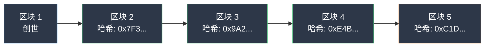

## 什么是区块链？

想象一本每个人都能看到、没有人能擦除的笔记本。每一页新纸（区块）包含一组交易和对前一页的引用。这本笔记本不在任何人的抽屉里——它在全球数千台计算机上同时存在副本。

这就是区块链：一个共享的、去中心化的、不可篡改的数字账本。

每当有人购买宾果彩票、进行抽奖或支付奖励时，这些都会被记录在这本笔记本中。任何人都可以查看。没有人能更改已写入的内容。

## 工作原理

### 区块与链

每个区块就像笔记本中的一页：

- 包含交易记录（彩票购买、抽奖、奖励）
- 有时间戳和唯一数字指纹（哈希值）
- 引用前一个区块的数字指纹

当有人试图篡改旧区块时，指纹会改变，链条断裂——每个节点都会立即检测到篡改。

每个区块锁定了前一个区块。更改一个区块意味着重新计算它之后的所有区块——跨越数千台计算机。这就是区块链防篡改的原因。

### 共识：无需老板的共识

在新区块添加之前，整个网络必须一致同意其有效。这称为共识。在 CryptoBingo 使用的 WAX 区块链上，这个过程大约需要 1.5 秒。

没有中央服务器控制数据。数千台独立的计算机（节点）维护着账本的相同副本。要欺骗系统，攻击者需要控制网络的一半以上——在像 WAX 这样的成熟区块链上几乎不可能。

### 不可篡改性：刻在石头上

一旦交易被记录并确认，就不能被更改或删除。对 CryptoBingo 来说，这意味着每次抽奖结果、每笔奖励支付和每次彩票购买都被永久记录。没有人——包括平台本身——能在事后更改结果。

### 透明性：公开可查

所有交易都是公开的。任何人都可以验证售出了多少彩票、支付了多少奖励以及结果是否公平。你不需要信任庄家——数据可供任何人查验。

## 关于区块链的常见误解

**"区块链就是加密货币。"** 不对。加密货币是区块链的一种应用——就像电子邮件是互联网的一种应用。区块链是信任的基础设施，货币只是第一个用例。

**"区块链很慢。"** 这取决于设计。WAX 在大约 1.5 秒内处理交易，零费用。WAX Cloud Wallet 让任何人能在 30 秒内使用 passkeys（面容 ID / 触控 ID）创建账户。许多人甚至不知道自己在使用区块链。

**"区块链使用复杂。"** 用户界面看起来和任何网站一样。区块链在后台隐形运行。你点击"购买彩票"，技术处理好其余一切。

**"区块链消耗巨大能源。"** 并非所有区块链都是比特币。WAX 自 2021 年起已实现碳中和。每笔交易消耗的能量与工作量证明链相比微不足道。

## 区块链在加密货币之外的应用

区块链技术有远超数字货币的应用场景：

- **游戏：** 可证明公平的随机结果、自动奖励支付、可验证的物品所有权
- **供应链：** 用防篡改记录追踪产品从工厂到商店
- **身份：** 自我主权身份，你掌控自己的个人数据
- **投票：** 透明、可审计的选举
- **房地产：** 不可篡改的产权记录和可编程转让

特别是对游戏而言，区块链消除了根本的信任问题：玩家不再需要相信平台是诚实的——代码保证诚实。

## 为什么 CryptoBingo 使用区块链

在线宾果存在信任问题。在传统平台上，运营者控制随机数生成器、奖池和支付系统。玩家必须相信运营者是诚实的。

CryptoBingo 通过将整个游戏放在 WAX 区块链上解决了这个问题：

1. **可证明公平的抽奖：** 每次抽奖使用具有三个独立熵源的加密随机数生成器。每局游戏后，任何人都可以验证结果未被操纵。请参阅我们的[可证明公平指南](/blog/provably-fair)了解技术细节。

2. **自动奖励：** 当你获胜时，智能合约立即处理支付。无需人工批准，无需延迟，无需"我们将在 3-5 个工作日内处理您的提现"。

3. **零隐藏费用：** 游戏规则编码在智能合约中，对所有人可见。彩票价格、奖励结构和支付规则不可篡改。

4. **完全透明：** 每次购买、每次抽奖、每次奖励都记录在公共区块链上。你可以验证任何游戏的完整历史。更多信息请参阅我们的[安全指南](/blog/cryptobingo-e-seguro)。

5. **无需信任：** 你不需要信任 CryptoBingo 团队。代码就是保证。常言道：*"不要信任，要验证。"*

## 常见问题

### 区块链和普通数据库有什么区别？

普通数据库由单一组织控制。他们可以更改数据、删除记录或停止服务。区块链由数千个独立节点控制。没有单一实体控制数据，记录不能被删除，只要至少有一个节点在运行，服务就会继续。

### 我需要了解区块链才能使用 CryptoBingo 吗？

不需要。你就像使用任何其他宾果平台一样使用网站。区块链在后台运行。如果你想验证结果，可以使用公共区块浏览器，无需任何特殊软件。

### 区块链游戏合法吗？

区块链游戏在许多司法管辖区存在监管灰色地带。CryptoBingo 遵守适用的法规运营。参与任何基于区块链的游戏平台前，请务必检查当地法律。

### 如何开始在 WAX 上使用？

在 mycloudwallet.com 创建 WAX Cloud Wallet。整个过程大约需要两分钟——选择用户名，设置 passkey（面容 ID 或指纹），钱包就准备好了。基本使用无需邮箱、密码或助记词。请按照我们的[钱包教程](/tutorials/criar-carteira-wax)获取分步指导。

## 总结

区块链是使 CryptoBingo 成为可能的基础设施：公平抽奖、即时奖励、完全透明、无需信任。你不需要了解所有技术细节就能受益——就像你不需要了解 TCP/IP 就能使用互联网一样。

不同的是，使用区块链，你可以亲自验证一切。每张彩票、每次抽奖、每个奖励都记录在公共笔记本中——人人可见，无人能改。

准备好开始了吗？[创建你的 WAX 钱包](/tutorials/criar-carteira-wax)，获取第一张彩票。

---

*Verified: July 2026. All information validated for accuracy and currency.*
