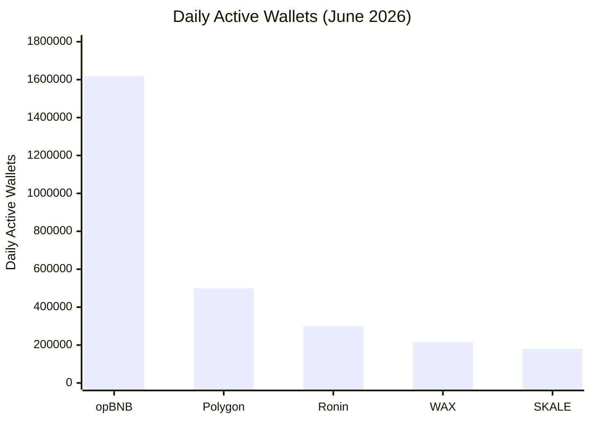

## 什么是WAX区块链？

WAX（Worldwide Asset eXchange，全球资产交易所）是一个专为游戏、NFT和数字资产构建的第一层区块链。与试图包揽一切的通用区块链不同，WAX针对游戏中最关键的需求进行了优化：速度、零费用和大规模采用。

WAX于2019年推出，运行在**Antelope框架**（原EOSIO）之上——与Telos、Vaulta（原EOS）、UX Network、Proton、Ultra和FIO基于相同技术。这一共同的底层基础意味着WAX继承了久经考验的基础设施，同时保持自己的专注：成为对普通用户最易访问的区块链。

**核心差异点：**
- **零Gas费** — 玩家无需支付交易费用
- **1.5秒出块时间**，即时最终确认
- **自2021年起碳中和**（Climate Care认证）
- **免费创建账户** — 无门槛，无需信用卡
- **基于Passkey的钱包** — 使用Face ID / Touch ID，无需助记词

## WAX有何特别之处？

### 零Gas费

在以太坊上，单笔交易根据网络拥堵情况可能花费1至50美元不等。在WAX上，交易完全免费。WAX不消耗手续费，而是采用基于资源的模型，用户通过质押WAXP代币来获取CPU和NET资源——或者使用2026年取消5 WAXP账户创建费后引入的免费PowerUp系统。

对游戏而言，这堪称革命性。玩家可以购买门票、领取奖励、交易资产数千次，无需担心Gas成本。其他链上扼杀微交易的那种摩擦，在WAX上根本不存在。

### 1.5秒最终确认

使用委托权益证明（DPoS）共识机制，每1.5秒产生一个区块。通过Savanna升级（Antelope Spring v1.0，2024年9月），最终确认时间从约3分钟降至约1秒——提升了100倍。

对比来看：
- **以太坊：** ~12秒出块，~2分钟概率性最终确认
- **比特币：** ~10分钟出块，~1小时完全确认
- **Polygon：** ~2秒，但最终确认依赖于以太坊结算

WAX提供近乎即时的结算——这对于实时游戏至关重要，等待数分钟的交易确认会彻底破坏用户体验。

### 自2021年起碳中和

WAX是少数几个获得Climate Care认证的碳中和区块链之一。其DPoS机制比工作量证明系统节能125,000倍。整个WAX网络的年能耗大约相当于5.5个美国家庭，同时抵消了超过211吨二氧化碳。

### 免费创建账户

2026年3月，WAX取消了5 WAXP的账户创建费，使新账户创建完全免费。结合新的基于Passkey的Cloud Wallet，任何人都可以在30秒内使用Face ID或Touch ID创建WAX账户——无需助记词、无需邮箱、无需密码。

## 关键数据

WAX在真实用户活跃度方面始终位居顶级游戏区块链之列：

- **215,650个每日活跃钱包**（2026年6月，Gate News）——在游戏链中排名第5，30天增长11.98%
- **每季度5.7至6.87亿笔交易** — 每位用户的交易量超过任何其他游戏链
- **超过1500万用户**和**超过3万个dApp** — Web3最大生态系统之一
- **每日超过2300万笔交易** — 持续吞吐量证明了基础设施的扩展能力
- **2024–2025年按钱包数计算第3大最活跃游戏区块链**（DappRadar）

**数据来源：** DappRadar、Gate News（2026年6月）、WAX.io

### WAX对比数据

*数据来源：Gate News，2026年6月*

## WAX vs 竞争对手

| 特性 | WAX | opBNB | Polygon | Ronin | Vaulta |
|------|-----|-------|---------|-------|--------|
| 交易费用 | 零 | 低（$0.001） | 低（$0.01） | 低（$0.001） | 低（$0.001） |
| 出块时间 | 1.5s | ~1s | ~2s | ~3s | ~1s |
| 最终确认 | ~1s | ~1s | ~2s（检查点） | ~3s | ~1s |
| 日活钱包（2026年6月） | 215K | 1.62M | ~500K | ~300K | ~50K |
| 每季度交易量 | ~687M | ~500M | ~400M | ~200M | ~100M |
| 碳中和 | 是 | 否 | 部分 | 否 | 否 |
| Cloud Wallet（Passkey） | 是（30秒） | 否 | 否 | 否 | 否 |
| Antelope原生 | 是 | 否 | 否 | 否 | 是 |
| 游戏专注 | 主要 | 通用 | 通用 | 游戏 | 金融 |
| 免费创建账户 | 是 | 否 | 否 | 否 | 否 |

WAX在**每钱包交易量**上胜出：每位WAX用户每月平均执行约599次链上操作——超过任何竞争链。这是衡量真实用户参与度的关键指标，而非仅仅是投机活动。

## WAX生态系统

### Alien Worlds

史上最受欢迎的区块链游戏，拥有**420,000个每月活跃钱包**（2025年第三季度）和超过90,000个每日活跃账户。玩家挖掘Trilium（TLM），争夺行星治理权，并参与DAO驱动的元宇宙，现已扩展至Mayhem、Outlaw Troopers和Planetary Defense等多个游戏。

### AtomicHub

WAX上最大的NFT市场，用户以接近零的费用买卖和创建NFT。仅在2024年第四季度，WAX就处理了316,080笔NFT销售，交易额达935,328美元。

### NeftyBlocks

一个带有游戏化工具的NFT创建平台——创作者可以启动卡包、设置版税、构建自定义店铺，无需编写代码。

### My Cloud Wallet（原WAX Cloud Wallet）

让区块链隐形化的钱包。自2026年3月起，日常使用采用Passkey（Face ID / Touch ID）替代密码或助记词。12词助记词作为恢复备份，但99%的用户永远不需要看到它。创建账户只需30秒，新的Vault功能（2026年）创建持久签名会话，让用户无需逐笔批准交易即可畅玩游戏。

WharfKit SDK和Cloud Wallet Bridge（支持TON、Solana、Ethereum、Polygon、BNB Smart Chain和Base）等企业级功能使WAX成为连接性最强的游戏区块链。

## WAX-TON跨链桥

WAX-TON跨链桥于2024年推出，将WAX连接到TON（Telegram Open Network）生态系统，使WAX能够触达Telegram的9亿月活跃用户。用户可以通过Cloud Wallet Bridge在WAX和TON之间无缝转移资产。

这使WAX成为**移动优先社交游戏**的门户——区块链资产与世界最大消息平台交汇之处。

## 为什么CryptoBingo选择WAX？

CryptoBingo的每场抽奖都需要快速、廉价且可在链上验证。WAX三者兼备：

- **即时抽奖：** 1.5秒出块时间，约1秒最终确认——玩家还没庆祝完，奖品已经确认
- **零费用：** 玩家购买门票和领取奖品无需支付Gas——无微交易摩擦
- **可验证公平：** WAX的RNG预言机（orng.wax）使用RSA 2048位签名，合约在链上验证每个结果
- **Passkey钱包：** 任何用户30秒内创建钱包即可开始游戏——无需加密知识
- **成熟生态系统：** 1500万用户、3万个dApp、久经考验的基础设施

对于可验证公平的宾果平台，WAX是唯一消除了普通用户与可验证链上游戏之间所有障碍的区块链。

## 常见问题

### WAX真的免费吗？

是的。WAX上的交易费用为零。用户无需支付Gas，而是通过质押WAXP获取CPU和NET资源，或使用免费的PowerUp系统。自2026年3月起，甚至账户创建也完全免费。

### 使用WAX需要加密经验吗？

不需要。My Cloud Wallet使用Passkey（Face ID / Touch ID）——你永远不需要查看或管理私钥。创建账户只需30秒，界面看起来和任何网站一样。区块链在后台隐形运行。

### WAX与以太坊在游戏方面相比如何？

WAX更快（1.5秒 vs 12秒出块）、更便宜（零费用 vs 1至50美元Gas费）、更节能（比以太坊PoW节能125,000倍）。以太坊拥有更多流动性和DeFi工具，但就游戏用户体验而言，WAX更胜一筹。

### WAX安全吗？

WAX采用委托权益证明机制，由21个选举产生的区块生产者维护网络。该网络自2019年运行以来，未发生重大安全事件。Savanna共识升级增加了BLS签名聚合和1秒最终确认，进一步强化了安全模型。

### 我能用WAX做什么？

玩区块链游戏（CryptoBingo、Alien Worlds、Splinterlands）、交易NFT（AtomicHub）、创建数字收藏品（NeftyBlocks）、质押代币获取奖励，以及将资产桥接到其他链（TON、Solana、Ethereum、Polygon）。

## 诚实风险

WAX高度依赖Alien Worlds，后者占据链上活动的很大一部分和约49%的TVL。Alien Worlds的衰退将实质性地影响整个链的指标。

零费用模型需要质押WAXP来获取CPU/NET资源——这可能会让那些期望真正免费交易但不了解底层资源模型的初学者感到困惑。

日活钱包在2024年第四季度曾下降（约191K），之后在2025至2026年间逐步恢复。该链的增长稳定但不爆炸性——相比之下opBNB拥有162万日活钱包。

尽管存在这些考量，WAX仍然是休闲游戏最易访问的区块链，拥有最成熟的游戏生态系统和Web3中最佳的用户入门体验。

## 总结

WAX是让链上游戏变得可及的区块链：零费用、近乎即时的最终确认、碳中和运营，以及一个像普通应用一样工作的钱包。拥有21.5万日活跃用户、1500万账户和以太坊之外最丰富的游戏生态系统，WAX是驱动下一代可验证、玩家拥有游戏的基础设施。

30秒内创建你的免费WAX钱包，体验无摩擦的链上游戏。

---
*Verified: July 2026. All information validated for accuracy and currency.*
