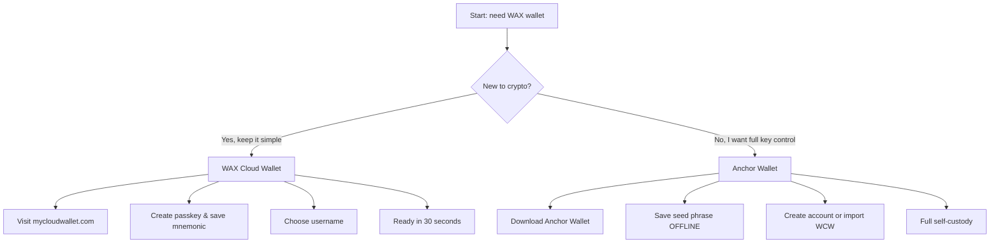

You need a WAX wallet to play CryptoBingo. A wallet holds your account, balance, tickets, and prizes on the WAX blockchain. Two great options — pick the one that fits you.

## Before You Start

Both wallets are **free** (Anchor charges $0.99 for on-chain account creation). You need a device with internet access and — for Cloud Wallet — biometric support (Face ID, Touch ID, or fingerprint reader).

---

## Option 1: WAX Cloud Wallet (Recommended for Beginners)

**My Cloud Wallet** is WAX's official wallet. Uses passkeys — no passwords to remember, no seed phrases for daily use. Works on desktop and mobile web.

**URL:** [mycloudwallet.com](https://www.mycloudwallet.com) (old wallet.wax.io redirects here)

### Create Your Account

1. Open [mycloudwallet.com](https://www.mycloudwallet.com) in your browser
2. Click **Sign Up** or **Create Account**
3. Your browser prompts you to create a **passkey** — use Face ID, Touch ID, fingerprint, or device PIN
4. After passkey is set, the wallet generates your **12-word mnemonic phrase**
5. **Write it down on paper. Store it in a safe place. Never digitally.** This is the only way to recover your account if you lose your device.
6. Verify the phrase — the wallet asks you to select specific words in order
7. Choose your **WAX username** — exactly 12 characters, letters a-z and numbers 1-5 only (e.g., `cryptobingofan`)
8. Done. Your wallet is ready.

**What you get:**
- Passkey login (Face ID / Touch ID / PIN)
- 12-word mnemonic recovery phrase (you control the keys)
- Vault Sessions — keep a session open for smoother gameplay
- NFT and token management built in

**Estimated time:** 30–60 seconds.

### Important: Save Your Mnemonic

This is the only checkpoint that matters. Without the mnemonic phrase, no one — not even WAX — can recover your account if you lose your device. Store it:

- ✅ Paper, written by hand
- ✅ Fireproof safe
- ✅ Multiple copies (different locations)
- ❌ Never screenshot
- ❌ Never cloud storage
- ❌ Never email or message

---

## Option 2: Anchor Wallet (Full Self-Custody)

**Anchor Wallet** by Greymass is an open-source desktop wallet for WAX and other Antelope blockchains. Your keys stay on your device — fully encrypted, never uploaded.

**URL:** [anchorwallet.org](https://www.anchorwallet.org)

### Install Anchor

1. Download from [anchorwallet.org](https://www.anchorwallet.org) — available for macOS, Windows, and Linux
2. Verify the download checksum (PGP fingerprint: `6B52 D1A4 4615 A18C 51C5 BCF4 679D D3C3 DA29 F8F3`)
3. Install and launch the app
4. Set a **wallet password** — this encrypts your keys locally

### Create a New WAX Account (with $0.99 fee)

1. In Anchor, go to **Tools → Manage Keys**
2. **Generate Key Pair (x2)** — one for Owner, one for Active
3. Save the generated keys to the wallet (enter your password to authorize)
4. Go to **WAX Account Setup → Create New Account**
5. Choose your 12-character username
6. Pay the $0.99 creation fee (goes to WAX network resources, not Anchor)
7. Import the account using the keys already saved in the wallet

### Import an Existing WAX Cloud Wallet Account (Free)

1. In Anchor, go to **Tools → Manage Keys**
2. Click **Import Key** and paste your WAX Cloud Wallet private key
   - *To find your WCW private key:* log in at mycloudwallet.com, go to Settings → Export Keys
3. Save the key to the wallet
4. Go to **WAX Account Setup → Automatically Detect**
5. Anchor scans the WAX blockchain for accounts matching your keys
6. Select the account and click **Import Account(s)**

**What you get:**
- Full private key control (self-custody)
- Human-readable transaction signing
- Ledger hardware wallet support
- Free transactions via Fuel (5ms CPU per day)
- Multi-chain support (EOS, Telos, Proton, FIO)

---

## Comparison

| Feature | WAX Cloud Wallet | Anchor Wallet |
|---|---|---|
| Setup time | 30 seconds | 5–10 minutes |
| Cost | Free | Free (account: $0.99) |
| Security model | Passkey + mnemonic | Seed phrase + password |
| Key control | Non-custodial (you hold mnemonic) | Full self-custody |
| Platform | Web (desktop + mobile) | Desktop (Win/Mac/Linux) + iOS |
| Hardware wallet | No | Ledger |
| Best for | Beginners, quick access | Power users, large holdings |
| Open source | No | Yes (github.com/greymass/anchor) |

---

## Which Wallet Should You Choose?

**Start with WAX Cloud Wallet.** Play CryptoBingo, learn the ecosystem, get comfortable. When you accumulate more tokens or want hardware wallet security, import your account into Anchor.

**Use Anchor if:** you already hold cryptocurrency, value full key control, or want to manage multiple Antelope accounts in one app.

---

## FAQ

**Can I use both wallets for the same account?** Yes. Create your account with WAX Cloud Wallet, then import the private key into Anchor. Both work simultaneously.

**What happens if I lose my device?** With WAX Cloud Wallet, restore using your 12-word mnemonic phrase on a new device. With Anchor, reinstall and enter your seed phrase.

**Is WAX Cloud Wallet really non-custodial?** Yes. Since the passkey update, your keys are generated on your device and backed up by the mnemonic phrase. WAX cannot access your account without your passkey or phrase.

**Can I create a WAX account without paying?** WAX Cloud Wallet covers the account creation cost when you sign up through their platform. Anchor charges $0.99 for direct account creation.

**How long is a WAX username?** Exactly 12 characters. Allowed: letters a–z and numbers 1–5. Example: `mygameaccount`.

---

## Next Step

Your wallet is ready. Now configure security and connect to CryptoBingo:

→ [How to Set Up Your WAX Wallet](/en/tutorial/configurar-carteira)
→ [Getting Started with CryptoBingo](/en/tutorial/primeiros-passos)

---

*Verified: July 2026. All information validated for accuracy and currency.*
