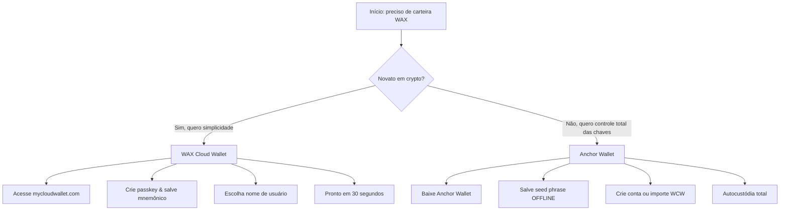

Você precisa de uma carteira WAX para jogar CryptoBingo. A carteira guarda sua conta, saldo, cartelas e prêmios na blockchain WAX. Duas ótimas opções — escolha a que melhor se encaixa.

## Antes de Começar

Ambas as carteiras são **gratuitas** (Anchor cobra US$ 0,99 pela criação de conta on-chain). Você precisa de um dispositivo com acesso à internet e — para Cloud Wallet — suporte a biometria (Face ID, Touch ID ou leitor de impressão digital).

---

## Opção 1: WAX Cloud Wallet (Recomendada para Iniciantes)

**My Cloud Wallet** é a carteira oficial da WAX. Usa passkeys — sem senhas para decorar, sem seed phrases para o dia a dia. Funciona em navegadores desktop e mobile.

**URL:** [mycloudwallet.com](https://www.mycloudwallet.com) (o antigo wallet.wax.io redireciona para cá)

### Criar Sua Conta

1. Abra [mycloudwallet.com](https://www.mycloudwallet.com) no seu navegador
2. Clique em **Sign Up** ou **Create Account**
3. Seu navegador solicitará a criação de uma **passkey** — use Face ID, Touch ID, impressão digital ou PIN do dispositivo
4. Após configurar a passkey, a carteira gera sua **frase mnemônica de 12 palavras**
5. **Anote no papel. Guarde em local seguro. Nunca digitalmente.** Esta é a única maneira de recuperar sua conta se perder o dispositivo.
6. Verifique a frase — a carteira pede para selecionar palavras específicas em ordem
7. Escolha seu **nome de usuário WAX** — exatamente 12 caracteres, apenas letras a-z e números 1-5 (ex.: `cryptobingofan`)
8. Pronto. Sua carteira está pronta.

**O que você recebe:**
- Login por passkey (Face ID / Touch ID / PIN)
- Frase mnemônica de 12 palavras para recuperação (você controla as chaves)
- Vault Sessions — mantenha sessão aberta para jogar sem interrupções
- Gerenciamento de NFTs e tokens integrado

**Tempo estimado:** 30–60 segundos.

### Importante: Salve Seu Mnemônico

Este é o único ponto de verificação que realmente importa. Sem a frase mnemônica, ninguém — nem mesmo a WAX — pode recuperar sua conta se você perder o dispositivo. Guarde:

- ✅ Papel, escrito à mão
- ✅ Cofre à prova de fogo
- ✅ Múltiplas cópias (locais diferentes)
- ❌ Nunca print de tela
- ❌ Nunca armazenamento em nuvem
- ❌ Nunca e-mail ou mensagem

---

## Opção 2: Anchor Wallet (Autocustódia Total)

**Anchor Wallet** da Greymass é uma carteira desktop open-source para WAX e outras blockchains Antelope. Suas chaves ficam no seu dispositivo — totalmente criptografadas, nunca enviadas.

**URL:** [anchorwallet.org](https://www.anchorwallet.org)

### Instalar Anchor

1. Baixe de [anchorwallet.org](https://www.anchorwallet.org) — disponível para macOS, Windows e Linux
2. Verifique o checksum do download (PGP fingerprint: `6B52 D1A4 4615 A18C 51C5 BCF4 679D D3C3 DA29 F8F3`)
3. Instale e abra o aplicativo
4. Defina uma **senha da carteira** — isso criptografa suas chaves localmente

### Criar uma Nova Conta WAX (com taxa de US$ 0,99)

1. No Anchor, vá em **Tools → Manage Keys**
2. **Generate Key Pair (x2)** — um para Owner, um para Active
3. Salve as chaves geradas na carteira (digite sua senha para autorizar)
4. Vá em **WAX Account Setup → Create New Account**
5. Escolha seu nome de usuário de 12 caracteres
6. Pague a taxa de criação de US$ 0,99 (vai para recursos da rede WAX, não para Anchor)
7. Importe a conta usando as chaves já salvas na carteira

### Importar uma Conta WAX Cloud Wallet Existente (Grátis)

1. No Anchor, vá em **Tools → Manage Keys**
2. Clique em **Import Key** e cole sua chave privada da WAX Cloud Wallet
   - *Para encontrar sua chave privada WCW:* faça login em mycloudwallet.com, vá em Settings → Export Keys
3. Salve a chave na carteira
4. Vá em **WAX Account Setup → Automatically Detect**
5. O Anchor varre a blockchain WAX em busca de contas que correspondem às suas chaves
6. Selecione a conta e clique em **Import Account(s)**

**O que você recebe:**
- Controle total das chaves privadas (autocustódia)
- Assinatura de transações legível por humanos
- Suporte a hardware wallet Ledger
- Transações gratuitas via Fuel (5ms de CPU por dia)
- Suporte a múltiplas blockchains (EOS, Telos, Proton, FIO)

---

## Comparativo

| Funcionalidade | WAX Cloud Wallet | Anchor Wallet |
|---|---|---|
| Tempo de configuração | 30 segundos | 5–10 minutos |
| Custo | Grátis | Grátis (conta: US$ 0,99) |
| Modelo de segurança | Passkey + mnemônico | Seed phrase + senha |
| Controle das chaves | Não custodial (você guarda o mnemônico) | Autocustódia total |
| Plataforma | Web (desktop + mobile) | Desktop (Win/Mac/Linux) + iOS |
| Hardware wallet | Não | Ledger |
| Melhor para | Iniciantes, acesso rápido | Usuários avançados, grandes saldos |
| Código aberto | Não | Sim (github.com/greymass/anchor) |

---

## Qual Carteira Escolher?

**Comece com WAX Cloud Wallet.** Jogue CryptoBingo, aprenda o ecossistema, fique confortável. Quando acumular mais tokens ou quiser segurança de hardware wallet, importe sua conta para o Anchor.

**Use Anchor se:** você já possui criptomoedas, valoriza controle total das chaves ou quer gerenciar múltiplas contas Antelope em um só aplicativo.

---

## FAQ

**Posso usar ambas as carteiras para a mesma conta?** Sim. Crie sua conta com WAX Cloud Wallet, depois importe a chave privada no Anchor. Ambas funcionam simultaneamente.

**O que acontece se eu perder meu dispositivo?** Com WAX Cloud Wallet, restaure usando sua frase mnemônica de 12 palavras em um novo dispositivo. Com Anchor, reinstale e digite sua seed phrase.

**WAX Cloud Wallet é realmente não custodial?** Sim. Desde a atualização de passkey, suas chaves são geradas no seu dispositivo e protegidas pela frase mnemônica. A WAX não pode acessar sua conta sem sua passkey ou frase.

**Posso criar uma conta WAX sem pagar?** WAX Cloud Wallet cobre o custo de criação de conta quando você se cadastra pela plataforma deles. Anchor cobra US$ 0,99 pela criação direta de conta.

**Qual o tamanho de um nome de usuário WAX?** Exatamente 12 caracteres. Permitidos: letras a–z e números 1–5. Exemplo: `mygameaccount`.

---

## Próximo Passo

Sua carteira está pronta. Agora configure a segurança e conecte-se ao CryptoBingo:

→ [Como Configurar Sua Carteira WAX](/pt/tutorial/configurar-carteira)
→ [Primeiros Passos no CryptoBingo](/pt/tutorial/primeiros-passos)

---

*Verification: July 2026. All information validated for accuracy and currency.*
