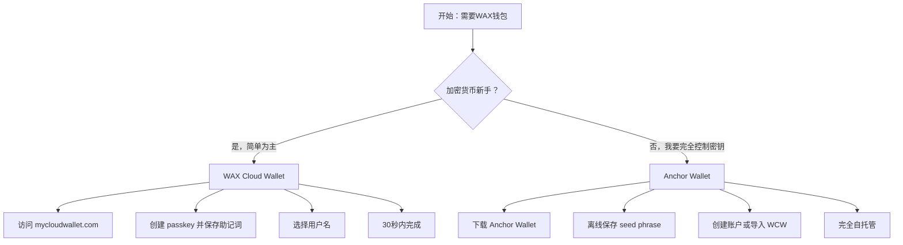

您需要一个WAX钱包才能玩CryptoBingo。钱包在WAX区块链上保管您的账户、余额、票券和奖金。两个优秀的选择 — 挑选最适合您的。

## 开始之前

两种钱包都是**免费的**（Anchor收取0.99美元用于链上账户创建）。您需要一台可以上网的设备，以及 — 对于Cloud Wallet — 生物识别支持（Face ID、Touch ID或指纹识别器）。

---

## 选项 1：WAX Cloud Wallet（推荐新手使用）

**My Cloud Wallet** 是WAX的官方钱包。使用passkeys — 无需记住密码，日常使用无需seed phrase。适用于桌面和移动浏览器。

**网址：** [mycloudwallet.com](https://www.mycloudwallet.com)（旧版 wallet.wax.io 会重定向至此）

### 创建账户

1. 在浏览器中打开 [mycloudwallet.com](https://www.mycloudwallet.com)
2. 点击 **Sign Up** 或 **Create Account**
3. 浏览器会提示您创建一个 **passkey** — 使用Face ID、Touch ID、指纹或设备PIN
4. 设置passkey后，钱包会生成您的 **12词助记词短语**
5. **用纸笔写下。存放在安全的地方。切勿以数字形式保存。** 这是您在丢失设备时恢复账户的唯一方式。
6. 验证短语 — 钱包要求按顺序选择特定单词
7. 选择您的 **WAX用户名** — 恰好12个字符，仅限字母a-z和数字1-5（例如：`cryptobingofan`）
8. 完成。您的钱包已就绪。

**您将获得：**
- Passkey登录（Face ID / Touch ID / PIN）
- 12词助记词恢复短语（您掌控密钥）
- Vault Sessions — 保持会话打开以获得更流畅的游戏体验
- 内置NFT和代币管理

**预计时间：** 30–60秒。

### 重要：保存您的助记词

这是唯一重要的检查点。没有助记词短语，如果您丢失设备，没有人 — 甚至WAX — 也无法恢复您的账户。请存放在：

- ✅ 纸张，手写
- ✅ 防火保险柜
- ✅ 多个副本（不同地点）
- ❌ 切勿截图
- ❌ 切勿使用云存储
- ❌ 切勿通过电子邮件或消息发送

---

## 选项 2：Anchor Wallet（完全自托管）

**Anchor Wallet** 由Greymass开发，是一款适用于WAX和其他Antelope区块链的开源桌面钱包。您的密钥保留在您的设备上 — 完全加密，从未上传。

**网址：** [anchorwallet.org](https://www.anchorwallet.org)

### 安装 Anchor

1. 从 [anchorwallet.org](https://www.anchorwallet.org) 下载 — 适用于macOS、Windows和Linux
2. 验证下载校验和（PGP指纹：`6B52 D1A4 4615 A18C 51C5 BCF4 679D D3C3 DA29 F8F3`）
3. 安装并启动应用程序
4. 设置**钱包密码** — 这会在本地加密您的密钥

### 创建新的WAX账户（需支付0.99美元费用）

1. 在Anchor中，前往 **Tools → Manage Keys**
2. **Generate Key Pair (x2)** — 一个用于Owner，一个用于Active
3. 将生成的密钥保存到钱包（输入密码以授权）
4. 前往 **WAX Account Setup → Create New Account**
5. 选择您的12字符用户名
6. 支付0.99美元创建费（用于WAX网络资源，非Anchor）
7. 使用已保存在钱包中的密钥导入账户

### 导入现有的WAX Cloud Wallet账户（免费）

1. 在Anchor中，前往 **Tools → Manage Keys**
2. 点击 **Import Key** 并粘贴您的WAX Cloud Wallet私钥
   - *查找您的WCW私钥：* 登录 mycloudwallet.com，前往 Settings → Export Keys
3. 将密钥保存到钱包
4. 前往 **WAX Account Setup → Automatically Detect**
5. Anchor会扫描WAX区块链，查找与您的密钥匹配的账户
6. 选择账户并点击 **Import Account(s)**

**您将获得：**
- 完全私钥控制（自托管）
- 人类可读的交易签名
- Ledger硬件钱包支持
- 通过Fuel免费交易（每天5ms CPU）
- 多链支持（EOS、Telos、Proton、FIO）

---

## 对比

| 功能 | WAX Cloud Wallet | Anchor Wallet |
|---|---|---|
| 设置时间 | 30秒 | 5–10分钟 |
| 费用 | 免费 | 免费（账户：0.99美元） |
| 安全模型 | Passkey + 助记词 | Seed phrase + 密码 |
| 密钥控制 | 非托管（您持有助记词） | 完全自托管 |
| 平台 | Web（桌面 + 移动） | 桌面（Win/Mac/Linux）+ iOS |
| 硬件钱包 | 不支持 | Ledger |
| 最适合 | 新手，快速访问 | 高级用户，大额持有 |
| 开源 | 否 | 是 (github.com/greymass/anchor) |

---

## 应该选择哪个钱包？

**从WAX Cloud Wallet开始。** 玩CryptoBingo，了解生态系统，熟悉起来。当您积累更多代币或想要硬件钱包安全性时，将您的账户导入Anchor。

**使用Anchor如果您：** 已经持有加密货币，重视完全密钥控制，或想在一个应用中管理多个Antelope账户。

---

## 常见问题

**我可以为同一个账户使用两种钱包吗？** 可以。先用WAX Cloud Wallet创建账户，再将私钥导入Anchor。两者可以同时使用。

**如果我丢失了设备怎么办？** 使用WAX Cloud Wallet时，可以在新设备上用12词助记词短语恢复。使用Anchor时，重新安装并输入您的seed phrase。

**WAX Cloud Wallet真的非托管吗？** 是的。自passkey更新以来，您的密钥在您的设备上生成，并由助记词短语备份。没有您的passkey或短语，WAX无法访问您的账户。

**我可以免费创建WAX账户吗？** WAX Cloud Wallet在您通过其平台注册时承担账户创建费用。Anchor对直接创建账户收取0.99美元。

**WAX用户名有多长？** 恰好12个字符。允许：字母a–z和数字1–5。示例：`mygameaccount`。

---

## 下一步

您的钱包已就绪。现在配置安全性并连接到CryptoBingo：

→ [如何设置您的WAX钱包](/zh/tutorial/configurar-carteira)
→ [CryptoBingo入门指南](/zh/tutorial/primeiros-passos)

---

*Verification: July 2026. All information validated for accuracy and currency.*
